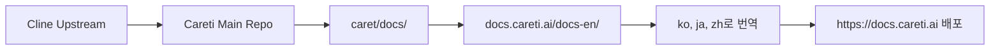

# Careti 문서 사이트

[English](README.md) | [한국어](README.ko.md)

🌍 **Careti AI 코딩 어시스턴트를 위한 다국어 문서 사이트**

이 저장소에는 Careti - [Cline](https://github.com/cline/cline)을 기반으로 한 AI 코딩 어시스턴트 - 의 공식 다국어 문서 사이트 [docs.careti.ai](https://docs.careti.ai)의 소스 코드가 포함되어 있습니다.

## 🎯 이 프로젝트에 대하여

Caret은 검증된 [Cline](https://github.com/cline/cline)을 기반으로, 강화된 기능과 폭넓은 다국어 지원을 더해 만들어졌습니다. 이 문서 사이트는 전 세계 개발자를 대상으로 다국어 가이드, 튜토리얼, 참조 자료를 제공합니다.

### ✨ Caret을 선택해야 하는 6가지 이유

1. **🔄 원클릭 모드 전환** - 완벽한 Cline 호환, 언제든 전환
2. **🎭 개인화된 AI 동반자** - 나만의 페르소나로 즐겁게 코딩
3. **🧠 강화된 시스템 프롬프트** - 더 똑똑하고 효율적인 응답
4. **🌍 4개 언어 지원** - 영어, 한국어, 일본어, 중국어 + 4개 언어 매뉴얼
5. **⌨️ 개선된 UX** - 프롬프트 히스토리, 자동 모델 가져오기 등
6. **🎯 31개 프로바이더, 266개 모델** - Cline v3.32.7 완벽 호환 + 확장

👉 **모든 전용 기능 보기**: [기능 전체 목록](https://docs.careti.ai/en/caret-exclusive/overview)

### 지원 언어
- 🇺🇸 **영어** (`/en`) - 전체 문서
- 🇰🇷 **한국어** (`/ko`) - 한국어 완전 지원
- 🇯🇵 **일본어** (`/ja`) - 日本語完全サポート
- 🇨🇳 **중국어** (`/zh`) - 中文完整支持

## 🚀 시작하기

### 필요 조건
- Node.js 18.x 이상
- npm 또는 yarn 패키지 매니저

### 설치

1. **저장소 클론**
   ```bash
   git clone https://github.com/caretive-ai/project-docs.careti.ai.git
   cd docs.careti.ai
   ```

2. **의존성 설치**
   ```bash
   npm install
   # or
   yarn
   ```

3. **개발 서버 시작**
   ```bash
   npm start
   # or
   yarn start
   ```
   
   사이트는 `http://localhost:3000`에서 확인할 수 있습니다.

### 언어별 개발

특정 언어 버전만 실행하려면:

```bash
# 영어 문서
npm run start:en     # http://localhost:3000/en

# 한국어 문서  
npm run start:ko     # http://localhost:3000/ko

# 일본어 문서
npm run start:ja     # http://localhost:3000/ja

# 중국어 문서
npm run start:zh     # http://localhost:3000/zh
```

## 🏗️ 빌드 및 배포

### 프로덕션 빌드
```bash
# 모든 언어 버전 빌드
npm run build
# or
yarn build
```

### 정적 호스팅
빌드 결과물은 `build/` 디렉터리에 생성되며, 다음과 같은 정적 호스팅 서비스에 배포할 수 있습니다:

- **Vercel**: GitHub 저장소 연결로 자동 배포
- **Netlify**: 드래그앤드롭 또는 GitHub 연동 배포  
- **GitHub Pages**: 빌드 파일을 활용한 정적 호스팅
- **AWS S3 + CloudFront**: 글로벌 확장에 적합

### GitHub Pages 배포
```bash
# SSH 사용
USE_SSH=true yarn deploy

# HTTPS 사용
GIT_USER=<Your GitHub username> yarn deploy
```

## 📁 프로젝트 구조

```
├── docs-en/          # 영어 문서 (Markdown/MDX)
├── docs-ko/          # 한국어 문서  
├── docs-ja/          # 일본어 문서
├── docs-zh/          # 중국어 문서
├── src/
│   └── pages/        # 언어 선택 메인 랜딩 페이지
├── static/           # 정적 에셋 (이미지, 아이콘 등)
├── scripts/          # 빌드·변환 스크립트
├── sidebars-*.ts     # 언어별 네비게이션 구조
├── docusaurus.config.ts  # Docusaurus 메인 설정
└── package.json      # 의존성 및 스크립트
```

### 주요 파일
- `docusaurus.config.ts` - 다중 인스턴스 설정을 포함한 메인 사이트 설정
- `sidebars-[lang].ts` - 언어별 네비게이션 구조
- `src/pages/index.tsx` - 언어 선택 카드가 있는 메인 랜딩 페이지
- `scripts/` - 자동 변환과 유지보수 스크립트

## 🛠️ 개발 스크립트

### 콘텐츠 관리
```bash
# Mintlify 형식을 Docusaurus로 변환 (신규 콘텐츠용)
./scripts/mintlify-to-docusaurus-converter-v2.sh [directory]

# 파일명을 'cline'에서 'caret'으로 일괄 변경
./scripts/cline-to-caret-renamer.sh [directory]

# 텍스트 'Cline'을 'Careti'으로 교체 (what-is-caret.mdx 표기 유지)
./scripts/cline-to-caret-content-replacer.sh [directory]

# 컴포넌트 포맷팅 이슈 수정
./scripts/fix-all-components.sh [directory]
```

### 개발 명령
```bash
npm start              # 메인 개발 서버 시작 (모든 언어)
npm run build          # 프로덕션 빌드
npm run serve          # 빌드 결과 로컬 서빙
npm run clear          # Docusaurus 캐시 삭제
npm run typecheck      # TypeScript 타입 체크
```

## 🌐 번역과 현지화

### 새로운 언어 추가하기

1. **문서 폴더 생성**
   ```bash
   mkdir docs-[lang-code]
   # 예: 프랑스어는 mkdir docs-fr
   ```

2. **콘텐츠 구조 복사**
   ```bash
   cp -r docs-en/* docs-[lang-code]/
   ```

3. **사이드바 설정 생성**
   ```bash
   cp sidebars-en.ts sidebars-[lang-code].ts
   ```

4. **`docusaurus.config.ts` 업데이트**
   플러그인 배열에 새 docs 인스턴스 추가:
   ```javascript
   [
     '@docusaurus/plugin-content-docs',
     {
       id: 'docs-[lang-code]',
       path: './docs-[lang-code]',
       routeBasePath: '[lang-code]',
       sidebarPath: './sidebars-[lang-code].ts',
     },
   ]
   ```

5. **메인 페이지 업데이트**
   `src/pages/index.tsx`에 언어 선택 카드를 추가

### 번역 가이드라인
- `what-is-caret.mdx`의 원본 Cline 표기는 유지
- 언어별로 일관된 기술 용어 사용
- 코드 예제와 명령어는 변경하지 않음
- UI 요소와 네비게이션 라벨은 번역
- 각 로케일의 날짜/시간 표기 사용

## 🤝 기여하기

문서 개선을 위한 모든 기여를 환영합니다! 다음 절차를 따라주세요.

### 콘텐츠 업데이트
1. 저장소를 포크합니다.
2. 브랜치를 생성합니다 (`git checkout -b feature/update-docs`).
3. 해당 언어 폴더에서 변경합니다.
4. 로컬에서 테스트합니다 (`npm start`).
5. 변경 사항을 커밋합니다 (`git commit -am 'Update documentation'`).
6. 포크로 푸시합니다 (`git push origin feature/update-docs`).
7. Pull Request를 생성합니다.

### 새로운 번역
1. 위 "새로운 언어 추가하기" 가이드를 따릅니다.
2. 기술 정확도를 유지하며 번역합니다.
3. 새 언어 버전을 충분히 테스트합니다.
4. 새 언어 지원을 담은 Pull Request를 제출합니다.

### 버그 리포트
- GitHub Issues를 사용해 문제를 보고합니다.
- 재현 절차를 포함합니다.
- 영향을 받는 언어 버전을 명시합니다.
- 필요하면 스크린샷을 첨부합니다.

## 📜 라이선스

이 프로젝트는 Apache 2.0 라이선스를 따릅니다. 자세한 내용은 [LICENSE](LICENSE) 파일을 확인하세요.

### 출처 표기
- **Careti Documentation**: Apache 2.0 © 2025 Caretive INC.
- **Based on Cline**: 본 프로젝트는 [Cline](https://github.com/cline/cline) (Apache 2.0 © 2025 Cline Bot Inc.)을 기반으로 합니다.
- **Docusaurus Framework**: MIT License © Meta Platforms, Inc.

## 🔄 Careti 메인 저장소와의 동기화

이 문서 사이트는 [Careti 메인 저장소](https://github.com/caretive-ai/project-careti)와 Cline 병합 프로세스를 따라 동기화됩니다.

### 개발자를 위한 최신 Cline 문서 동기화

Caret이 Cline 업스트림을 병합할 때, 새 문서는 이 사이트와 동기화해야 합니다.

1. **Careti 병합 전략 가이드 확인**:
   - [영어 버전](https://github.com/caretive-ai/project-careti/blob/main/.agents/context/workflows/merge-strategy.md#5-documentation-site-synchronization-docscaret​team)
   - [한국어 버전](https://github.com/caretive-ai/project-careti/blob/main/caret-docs/development/workflows/merge-strategy.md#5-문서-사이트-동기화-docscaret​team)

2. **상세 동기화 분석**:
   종합적인 동기화 계획을 확인하세요:
   - [docs.careti.ai 동기화 분석 (한국어)](https://github.com/caretive-ai/project-careti/blob/main/caret-docs/work-logs/luke/2025-10-14-docs-caret-team-sync-analysis.md)

3. **빠른 시작**:
   ```bash
   # Careti 메인 저장소 안에 이 저장소 클론
   cd /path/to/caret
   git clone https://github.com/caretive-ai/project-docs.careti.ai

   # 동기화는 병합 전략 가이드를 따릅니다
   ```

### 워크플로 개요



**핵심 단계**:
1. Caret이 Cline 업스트림을 병합
2. 새로운 Cline 문서가 `caret/docs/`에 반영
3. 브랜드 변경: Cline → Careti
4. `docs.careti.ai/docs-en/`으로 동기화
5. 한국어·일본어·중국어로 번역
6. 빌드 및 배포

## 🔗 연관 프로젝트

- **[Careti Extension](https://github.com/caretive-ai/project-careti)** - 주요 Careti VS Code 확장
- **[Cline Project](https://github.com/cline/cline)** - 오리지널 Cline 자율 코딩 에이전트
- **[Careti Website](https://careti.ai)** - 공식 Careti 웹사이트

## 📞 지원

- **문서 이슈**: [GitHub Issues](https://github.com/caretive-ai/project-docs.careti.ai/issues)
- **Careti 지원**: [Careti GitHub Discussions](https://github.com/caretive-ai/project-careti/discussions)  
- **커뮤니티**: 개발자 커뮤니티에서 질문과 토론에 참여하세요

---

Docusaurus로 ❤️를 담아 제작 • 전 세계 개발자에게 모국어로 서비스를 제공합니다
