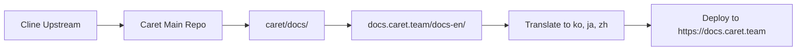

# Caret Documentation Site

[English](README.md) | [한국어](README.ko.md)

🌍 **Multilingual Documentation Site for Caret AI Coding Assistant**

This repository contains the source code for [docs.caret.team](https://docs.caret.team), the official multilingual documentation website for Caret - an AI-powered coding assistant based on [Cline](https://github.com/cline/cline).

## 🎯 About This Project

Caret is built on the proven foundation of [Cline](https://github.com/cline/cline), adding enhanced features and comprehensive multilingual support. This documentation site serves developers worldwide with comprehensive guides, tutorials, and reference materials in multiple languages.

### ✨ Why Choose Caret? 6 Key Reasons

1. **🔄 One-Click Mode Switching** - Perfect Cline compatibility, switch anytime
2. **🎭 Personalized AI Companion** - Your unique persona for enjoyable coding
3. **🧠 Enhanced System Prompts** - Smarter and more efficient AI responses
4. **🌍 4 Languages Support** - English, Korean, Japanese, Chinese + 4-language manuals
5. **⌨️ Enhanced UX** - Prompt history, automatic model fetching, and more
6. **🎯 31 Providers, 266 Models** - Cline v3.32.7 fully compatible + extended

👉 **See all exclusive features**: [Complete Features Overview](https://docs.caret.team/en/caret-exclusive/overview)

### Supported Languages
- 🇺🇸 **English** (`/en`) - Complete documentation
- 🇰🇷 **Korean** (`/ko`) - 한국어 완전 지원 
- 🇯🇵 **Japanese** (`/ja`) - 日本語完全サポート
- 🇨🇳 **Chinese** (`/zh`) - 中文完整支持

## 🚀 Getting Started

### Prerequisites
- Node.js 18.x or higher
- npm or yarn package manager

### Installation

1. **Clone the repository**
   ```bash
   git clone https://github.com/aicoding-caret/docs.caret.team.git
   cd docs.caret.team
   ```

2. **Install dependencies**
   ```bash
   npm install
   # or
   yarn
   ```

3. **Start development server**
   ```bash
   npm start
   # or
   yarn start
   ```
   
   The site will be available at `http://localhost:3000`

### Language-specific Development

To work on specific language versions:

```bash
# English documentation
npm run start:en     # Available at http://localhost:3000/en

# Korean documentation  
npm run start:ko     # Available at http://localhost:3000/ko

# Japanese documentation
npm run start:ja     # Available at http://localhost:3000/ja

# Chinese documentation
npm run start:zh     # Available at http://localhost:3000/zh
```

## 🏗️ Build and Deployment

### Production Build
```bash
# Build all language versions
npm run build
# or
yarn build
```

### Static Hosting
The built files will be in the `build/` directory and can be deployed to any static hosting service:

- **Vercel**: Connect your GitHub repository for automatic deployments
- **Netlify**: Deploy with drag-and-drop or GitHub integration  
- **GitHub Pages**: Use the built files for static hosting
- **AWS S3 + CloudFront**: For scalable global distribution

### GitHub Pages Deployment
```bash
# Using SSH
USE_SSH=true yarn deploy

# Using HTTPS
GIT_USER=<Your GitHub username> yarn deploy
```

## 📁 Project Structure

```
├── docs-en/          # English documentation (Markdown/MDX files)
├── docs-ko/          # Korean documentation  
├── docs-ja/          # Japanese documentation
├── docs-zh/          # Chinese documentation
├── src/
│   └── pages/        # Main landing page with language selection
├── static/           # Static assets (images, icons, files)
├── scripts/          # Build and conversion scripts
├── sidebars-*.ts     # Navigation structure for each language
├── docusaurus.config.ts  # Main Docusaurus configuration
└── package.json      # Dependencies and build scripts
```

### Key Files
- `docusaurus.config.ts` - Main site configuration with multi-instance setup
- `sidebars-[lang].ts` - Navigation structure for each language
- `src/pages/index.tsx` - Main landing page with language selection cards
- `scripts/` - Automated conversion and maintenance scripts

## 🛠️ Development Scripts

### Content Management
```bash
# Convert Mintlify format to Docusaurus (for new content)
./scripts/mintlify-to-docusaurus-converter-v2.sh [directory]

# Rename files from 'cline' to 'caret'
./scripts/cline-to-caret-renamer.sh [directory]

# Replace 'Cline' text with 'Caret' (preserves what-is-caret.mdx attribution)
./scripts/cline-to-caret-content-replacer.sh [directory]

# Fix component formatting issues
./scripts/fix-all-components.sh [directory]
```

### Development Commands
```bash
npm start              # Start main dev server (all languages)
npm run build          # Build production site
npm run serve          # Serve built site locally
npm run clear          # Clear Docusaurus cache
npm run typecheck      # TypeScript type checking
```

## 🌐 Translation and Localization

### Adding New Languages

1. **Create documentation folder**
   ```bash
   mkdir docs-[lang-code]
   # Example: mkdir docs-fr for French
   ```

2. **Copy content structure**
   ```bash
   cp -r docs-en/* docs-[lang-code]/
   ```

3. **Create sidebar configuration**
   ```bash
   cp sidebars-en.ts sidebars-[lang-code].ts
   ```

4. **Update `docusaurus.config.ts`**
   Add new docs instance in plugins array:
   ```javascript
   [
     '@docusaurus/plugin-content-docs',
     {
       id: 'docs-[lang-code]',
       path: './docs-[lang-code]',
       routeBasePath: '[lang-code]',
       sidebarPath: './sidebars-[lang-code].ts',
     },
   ]
   ```

5. **Update main page**
   Add language selection card in `src/pages/index.tsx`

### Translation Guidelines
- Preserve original Cline attribution in `what-is-caret.mdx` files
- Maintain consistent technical terminology across languages
- Keep code examples and command syntax unchanged
- Translate UI elements and navigation labels
- Use native date/time formats for each locale

## 🤝 Contributing

We welcome contributions to improve the documentation! Here's how to help:

### Content Updates
1. Fork the repository
2. Create a feature branch (`git checkout -b feature/update-docs`)
3. Make your changes in the appropriate language folder(s)
4. Test your changes locally (`npm start`)
5. Commit your changes (`git commit -am 'Update documentation'`)
6. Push to your fork (`git push origin feature/update-docs`)
7. Create a Pull Request

### New Translations
1. Follow the "Adding New Languages" guide above
2. Translate content while preserving technical accuracy
3. Test the new language version thoroughly
4. Submit a Pull Request with the new language support

### Bug Reports
- Use GitHub Issues to report problems
- Include steps to reproduce the issue
- Specify which language version is affected
- Provide screenshots if relevant

## 📜 License

This project is licensed under the Apache 2.0 License - see the [LICENSE](LICENSE) file for details.

### Attribution
- **Caret Documentation**: Apache 2.0 © 2025 Caretive INC.
- **Based on Cline**: This project builds upon [Cline](https://github.com/cline/cline) (Apache 2.0 © 2025 Cline Bot Inc.)
- **Docusaurus Framework**: MIT License © Meta Platforms, Inc.

## 🔄 Synchronization with Caret Main Repository

This documentation site is synchronized with the [Caret main repository](https://github.com/aicoding-caret/caret) following the Cline merge process.

### For Developers: Syncing Latest Cline Documentation

When Caret merges upstream Cline updates, new documentation must be synced to this site:

1. **Follow the Caret Merge Strategy Guide**:
   - [English Version](https://github.com/aicoding-caret/caret/blob/main/.agents/context/workflows/merge-strategy.md#5-documentation-site-synchronization-docscaret​team)
   - [Korean Version](https://github.com/aicoding-caret/caret/blob/main/caret-docs/development/workflows/merge-strategy.md#5-문서-사이트-동기화-docscaret​team)

2. **Detailed Sync Analysis**:
   See the comprehensive synchronization plan:
   - [docs.caret.team Sync Analysis (Korean)](https://github.com/aicoding-caret/caret/blob/main/caret-docs/work-logs/luke/2025-10-14-docs-caret-team-sync-analysis.md)

3. **Quick Start**:
   ```bash
   # Clone this repo inside Caret main repo
   cd /path/to/caret
   git clone https://github.com/aicoding-caret/docs.caret.team

   # Follow the merge strategy guide for synchronization
   ```

### Workflow Overview



**Key Process**:
1. Caret merges from Cline upstream
2. New Cline docs appear in `caret/docs/`
3. Brand conversion: Cline → Caret
4. Sync to `docs.caret.team/docs-en/`
5. Translate to Korean, Japanese, Chinese
6. Build and deploy

## 🔗 Related Projects

- **[Caret Extension](https://github.com/aicoding-caret/caret)** - Main Caret VS Code extension
- **[Cline Project](https://github.com/cline/cline)** - Original Cline autonomous coding agent
- **[Caret Website](https://caret.team)** - Official Caret website

## 📞 Support

- **Documentation Issues**: [GitHub Issues](https://github.com/aicoding-caret/docs.caret.team/issues)
- **Caret Support**: [Caret GitHub Discussions](https://github.com/aicoding-caret/caret/discussions)  
- **Community**: Join our developer community for questions and discussions

---

Built with ❤️ using [Docusaurus](https://docusaurus.io/) • Serving developers worldwide in their native languages
