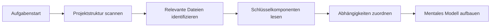

<Info>
**Schnelvreferenz**

- **Kontext** = Alle Informationen, die Careti über Ihr Projekt kennt
- **Kontextfenster** = Maximale Informationen, die Careti auf einmal verarbeiten kann (variiert je nach Modell)
- **Token** = Textmesseinheit (~3/4 eines englischen Wortes)
- **Automatische Verwaltung** = Careti verwaltet den Kontext automatisch über Focus Chain & Auto Compact
</Info>

## Was ist Kontextverwaltung?

Kontextverwaltung ist, wie Careti das Verständnis Ihres Projekts während eines Gesprächs aufrechterhält. Denken Sie daran als den gemeinsamen Speicher zwischen Ihnen und Careti - enthaltend Code, Entscheidungen, Anforderungen und Fortschritt.

<Frame caption="Kontext ist wie ein gemeinsamer Arbeitsbereich, in dem Careti sein Verständnis Ihres Projekts entwickelt">
	
</Frame>

### Die drei Ebenen des Kontexts

1. **Unmittelbarer Kontext** - Aktuelle Unterhaltung und aktive Dateien
2. **Projektkontext** - Ihre Codebasis, Struktur und Muster
3. **Persistenter Kontext** - AGENTS.md, .agents/context, caret-docs und work-logs

## Kontextfenster verstehen

Jedes KI-Modell hat ein **Kontextfenster** - die maximale Informationsmenge, die es in einem Gespräch verarbeiten kann. Dies wird in Token gemessen:

### Token-Limits nach Modell

| Modell | Kontextfenster | Effektives Limit* | Am besten für |
|-------|---------------|-----------------|----------|
| **Claude 3.5 Sonnet** | 200.000 Token | 150.000 Token | Komplexe Aufgaben, große Codebases |
| **Claude 3.5 Haiku** | 200.000 Token | 150.000 Token | Schnellere Antworten, einfachere Aufgaben |
| **GPT-4o** | 128.000 Token | 100.000 Token | Allgemeine Entwicklung |
| **Gemini 2.0 Flash** | 1.000.000+ Token | 400.000 Token | Sehr große Kontexte |
| **DeepSeek v3** | 64.000 Token | 50.000 Token | Kostengünstige Codierung |
| **Qwen 2.5 Coder** | 128.000 Token | 100.000 Token | Spezialisierte Codierungsaufgaben |

*Effektives Limit ist ~75-80% des Maximums für optimale Leistung

<Tip>
**Token-Mathematik leicht gemacht**
- 1 Token ≈ 3/4 eines englischen Wortes
- 100 Token ≈ 75 Wörter ≈ 3-5 Codezeilen
- 10.000 Token ≈ 7.500 Wörter ≈ ~15 Textseiten
- Eine typische Quelldatei: 500-2.000 Token
</Tip>

## Wie Careti Kontext aufbaut

Der Aufbau eines effektiven Kontexts ist das, was Careti wirklich nützlich macht. Wenn Sie eine Aufgabe starten, wartet Careti nicht einfach passiv auf Informationen - er sammelt aktiv Kontexte über Ihr Projekt zusammen, stellt bei Bedarf Klarungsfragen und passt sich an das Geschehen in Echtzeit an. Diese Kombination aus automatischer Erkennung, Benutzerführung und dynamischer Anpassung gewährleistet, dass Careti immer die richtigen Informationen hat, um Ihre Probleme effektiv zu lösen.

### 1. Automatische Kontexterfassung

Wenn Sie eine Aufgabe starten, reagiert Careti proaktiv:

**Was Careti automatisch entdeckt:**
- Projektstruktur und Dateiorganisation
- Import-Beziehungen und Abhängigkeiten
- Code-Muster und Konventionen
- Konfigurationsdateien und Einstellungen
- Aktuelle Änderungen und git-Verlauf (wenn @git verwendet wird)

### 2. Benutzergesteuerter Kontext

Während die automatische Erkennung viel der Arbeit bewältigt, kontrollieren Sie, worauf sich Careti konzentriert. Je spezifischer und relevanter der Kontext ist, den Sie bereitstellen, desto besser kann Careti Ihre Anforderungen verstehen und genaue Lösungen liefern.

Sie erweitern den Kontext durch:
- **@Mentions** von Dateien, Ordnern oder URLs
- **Anforderungen bereitstellen** in natürlicher Sprache
- **Screenshots teilen** für UI-Kontext
- **Dokumentation hinzufügen** über AGENTS.md + .agents/context + caret-docs
- **Fragen beantworten**, wenn Careti Klarstellung benötigt

### 3. Dynamische Kontextanpassung

Careti passt den Kontext während Ihres Gesprächs dynamisch an. Es berücksichtigt die Komplexität Ihrer Anfrage, verfügbaren Kontextfensterraum, aktuellen Aufgabenfortschritt, Fehlermeldungen und Feedback sowie frühere Entscheidungen, die während des Gesprächs getroffen wurden, um zu bestimmen, welche Informationen bei jedem Schritt am wichtigsten sind.

## Die Kontextfenster-Fortschrittsleiste

Überwachen Sie Ihre Kontextnutzung in Echtzeit:

<Frame caption="Die Kontextfensterleiste zeigt die Ein-/Ausgabe-Token-Nutzung">
	
</Frame>

### Die Indikatoren verstehen

- ⬆️ **Input-Token**: An das Modell gesendete Informationen (Ihre Nachrichten + Kontext)
- ⬇️ **Output-Token**: Antworten und generierter Code des Modells
- ➡️ **Cache-Token**: Zuvor verarbeitete Token, die wiederverwendet werden (reduziert Kosten und verbessert Geschwindigkeit)
- **Fortschrittsleiste**: Visuelle Darstellung der Nutzung
- **Prozentsatz**: Aktuelle Nutzung der Gesamtkapazität

## Automatische Kontextverwaltungsfunktionen

Careti umfasst intelligente Systeme, die den Kontext für Sie verwalten:

### Focus Chain (Standard: AN)

Focus Chain erhält die Aufgabenkontinuität durch automatische Todo-Listen. Wenn Sie eine Aufgabe starten, generiert Careti umsetzbare Schritte und aktualisiert sie beim Arbeitsfortschritt. Dies hält kritische Kontext sichtbar, auch nach Auto Compact ausgeführt wurde, sodass Sie den Fortschritt verfolgen können, ohne durch das gesamte Gespräch zu blättern.

[Mehr erfahren →](/de/features/focus-chain)

### Auto Compact (Immer AN)

Wenn die Kontextnutzung etwa 80% erreicht, erstellt Auto Compact automatisch eine umfassende Zusammenfassung des Gesprächs. Dies bewahrt alle Entscheidungen und Codeänderungen auf, während Platz für weitere Arbeit freigegeben wird. Sie sehen eine Nachricht, wenn dies geschieht. Die Aufgabe läuft nahtlos weiter - Sie müssen nichts tun.

[Mehr erfahren →](/de/features/auto-compact)

### Kontextkürzungssystem

Falls sich Ihr Gespräch dem Kontextfensterlimit des Modells nähert, bevor Auto Compact läuft, kürzt Carets Kontext-Manager automatisch ältere Teile des Gesprächs, um Fehler zu vermeiden.

Das System priorisiert das Wichtigste:
- Ihre ursprüngliche Aufgabenbeschreibung bleibt
- Aktuelle Werkzeugausführungen und deren Ergebnisse bleiben intakt
- Der aktuelle Codezustand und aktive Fehler werden beibehalten
- Der logische Fluss von Benutzer-Assistent-Nachrichten wird beibehalten

Was zuerst entfernt wird:
- Redundante Unterhaltungsverlauf aus früheren Aufgaben
- Abgeschlossene Werkzeugausgaben, die nicht mehr relevant sind
- Zwischenschritte beim Debuggen
- Ausführliche Erklärungen, die ihren Zweck erfüllt haben

Dies geschieht automatisch. Sie arbeiten weiterhin ohne Unterbrechung, und Careti behält genug Kontext bei, um Ihr Problem weiterhin effektiv zu lösen.

## Best Practices

- **Seien Sie spezifisch** - Klare Ziele helfen Careti, Ihre Anforderungen zu verstehen
- **Verwenden Sie @Mentions strategisch** - Referenzieren Sie bestimmte Dateien anstelle von ganzen Ordnern
- **Überwachen Sie die Fortschrittsleiste** - Gelb/Rot bedeutet, erwägen Sie die Verwendung von `/smol` oder `/newtask`
- **Vertrauen Sie automatischer Verwaltung** - Focus Chain und Auto Compact handhaben Komplexität automatisch
- **Verwenden Sie das Careti Context System** - Halten Sie AGENTS.md + .agents/context + caret-docs ausgerichtet

## Nächste Schritte

<CardGroup cols={2}>
	<Card title="Focus Chain" icon="link" href="/de/features/focus-chain">
		Erfahren Sie, wie Focus Chain die Aufgabenkontinuität aufrechterhält
	</Card>
	<Card title="Auto Compact" icon="compress" href="/de/features/auto-compact">
		Verstehen Sie die automatische Gesprächskomprimierung
	</Card>
	<Card title="Careti Context System" icon="brain" href="/de/prompting/caret-memory-bank">
		Ersetzen Sie Memory Bank mit AGENTS.md + .agents/context
	</Card>
	<Card title="Careti Rules" icon="gavel" href="/de/features/caret-rules">
		Definieren Sie projektspezifische Konventionen
	</Card>
</CardGroup>
