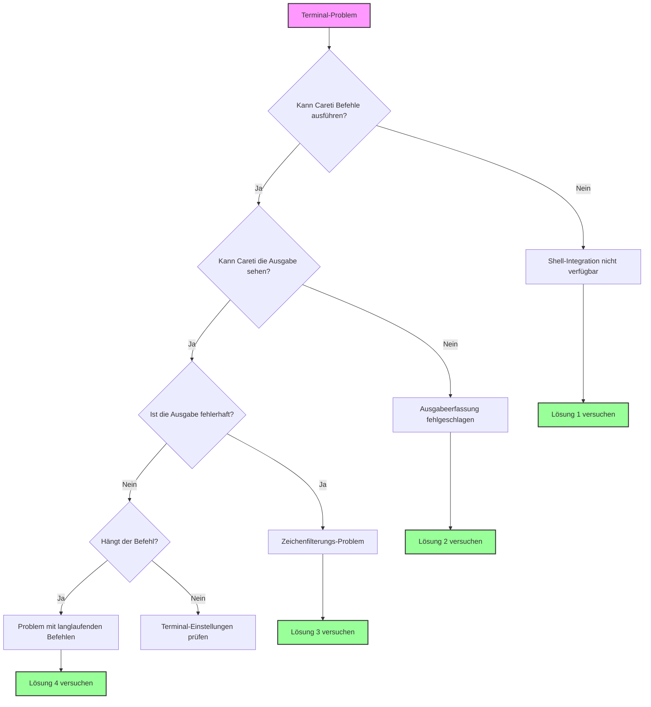

Dieser Leitfaden hilft Ihnen bei der Behebung von Terminal-Integrationsproblemen in Careti. Die Terminal-Integration ist entscheidend, damit Careti Befehle ausführen und deren Ausgabe lesen kann, was es ermöglicht, Fehler, Testergebnisse und Befehlsantworten zu verstehen.

<Tip>
	Wenn Sie Terminal-Probleme haben, versuchen Sie, in den Careti-Einstellungen unter „Terminal Settings“ zu einer einfacheren Shell wie `bash` zu wechseln.

    Dies löst die meisten Terminal-Integrationsprobleme.
</Tip>

## Schnell-Diagnose-Ablaufdiagramm

Folgen Sie diesem Ablaufdiagramm, um Ihr Problem schnell zu identifizieren:



## Häufige Probleme & Schnelle Lösungen

### 1. Shell-Integration nicht verfügbar

**Symptome:**

-   Meldung: „Shell Integration Unavailable“
-   Befehle werden ausgeführt, aber Careti kann die Ausgabe nicht lesen
-   Das Terminal funktioniert manuell einwandfrei, aber nicht mit Careti

**Schnelle Lösungen:**

#### macOS

-   **Zu bash wechseln**

    1. Öffnen Sie die Careti Settings
    2. Klicken Sie mit der linken Maustaste auf den Tab **„Terminal Settings“**
    3. Navigieren Sie zu **„Default Terminal Profile“** und wählen Sie **„bash“** aus dem Drop-down-Menü

-   **Oh-My-Zsh vorübergehend deaktivieren**:

    1. Wenn Sie zsh verwenden, geben Sie `mv ~/.zshrc ~/.zshrc.backup` im Terminal ein
    2. Starten Sie VS Code neu

-   **Environment setzen**:
    1.a Für Zsh-Benutzer: Verwenden Sie einen der folgenden Zsh-Befehle, um Ihr Shell-Profil zu bearbeiten:

          - `nano ~/.zshrc`
          - `vim ~/.zshrc`
          - `code ~/.zshrc`

    1.b Für Bash-Benutzer:

          - nano ~/.bash_profile

    2. Fügen Sie folgendes zu Ihrer Shell-Konfiguration hinzu: `export TERM=xterm-256color`
    3. Speichern Sie Ihre Konfiguration

#### Windows

-   **PowerShell 7 verwenden**

    1. Aus dem Microsoft Store installieren
    2. Öffnen Sie die Careti Settings
    3. Klicken Sie mit der linken Maustaste auf den Tab **„Terminal Settings“**
    4. Navigieren Sie zu **„Default Terminal Profile“** und wählen Sie **„PowerShell 7“** aus dem Drop-down-Menü

-   **Windows ConPTY deaktivieren**

    1. Navigieren Sie zu Ihren VS Code Settings
    2. Geben Sie „Integrated: Windows Enable Conpty“ in die Suchleiste der Settings ein
    3. Deaktivieren Sie die Option

-   **Eingabeaufforderung (Command Prompt) versuchen**
    1. Öffnen Sie die Careti Settings
    2. Klicken Sie mit der linken Maustaste auf den Tab **„Terminal Settings“**
    3. Navigieren Sie zu **„Default Terminal Profile“** und wählen Sie **„Command Prompt“** aus dem Drop-down-Menü

#### Linux

-   **bash verwenden**

    1. Öffnen Sie die Careti Settings
    2. Klicken Sie mit der linken Maustaste auf den Tab **„Terminal Settings“**
    3. Navigieren Sie zu **„Default Terminal Profile“** und wählen Sie **„bash“** aus dem Drop-down-Menü

-   **Berechtigungen prüfen**

    1. Stellen Sie sicher, dass VS Code über Terminal-Zugriffsberechtigungen verfügt

-   **Benutzerdefinierte Prompts deaktivieren**
    1. Kommentieren Sie Prompt-Anpassungen in der `.bashrc` aus

### 2. Befehlsausgabe nicht sichtbar

**Symptome:**

-   Careti meldet im Chat: „[Command is running but producing no output]“
-   Befehle werden abgeschlossen, aber Careti sieht die Ergebnisse nicht
-   Befehle funktionieren manchmal, aber nicht konsistent

**Lösungen:**

-   **Shell-Integration-Timeout erhöhen**

    1. Klicken Sie innerhalb von Careti auf die Schaltfläche **Settings** in der oberen rechten Ecke des Chat-Fensters
    2. Klicken Sie im **Settings**-Fenster in der linken Spalte auf den Tab **„Terminal Settings“**
    3. Navigieren Sie zu „Shell integration timeout (seconds)“ und geben Sie **„10“** in das Textfeld ein

-   **Terminal-Wiederverwendung deaktivieren**

    1. Klicken Sie innerhalb von Careti auf die Schaltfläche **Settings** in der oberen rechten Ecke des Chat-Fensters
    2. Klicken Sie im **Settings**-Fenster in der linken Spalte auf den Tab **„Terminal Settings“**
    3. Suchen Sie nach **„Enable aggressive terminal reuse“** und **deaktivieren** Sie diese Option

-   **Auf störende Extensions prüfen**
    1. Deaktivieren Sie andere terminalbezogene VS Code Extensions

### 3. Probleme bei der Zeichenfilterung

**Symptome:**

-   Kommas fehlen in der Ausgabe (JSON erscheint beschädigt)
-   Sonderzeichen werden aus der Terminal-Ausgabe entfernt
-   Syntaxfehler, die bei manueller Ausführung nicht auftreten

**Lösung:**
Dies ist ein bekannter Fehler bei der Ausgabeverarbeitung. Workarounds:

-   Empfehlen Sie der AI, stattdessen die Dateiausgabe zu verwenden
    1. Weisen Sie Careti im Chat oder über Careti-Regeln an, `command > output.txt` zu verwenden, bevor die Datei(en) gelesen werden

<Tip>
	Diese Kategorie von Problemen ist in den neuesten Careti-Versionen nur teilweise gelöst. Wenn Sie also weiterhin damit konfrontiert sind, erstellen Sie ein GitHub-Issue, falls es sich um ein dauerhaftes Problem handelt.
</Tip>

### 4. Langlaufende Befehle & Fortschrittsbalken

**Symptome:**

-   Docker-Builds werden in Careti nie abgeschlossen
-   Fortschrittsbalken verbrauchen tausende Tokens
-   Die Careti-Schaltfläche „Proceed while running“ funktioniert im Chat nicht ordnungsgemäß

<Tip>
	Diese Kategorie von Problemen wurde in den neuesten Careti-Versionen gelöst. Sollten Sie dennoch auf Probleme stoßen, erstellen Sie bitte ein GitHub-Issue dazu.
</Tip>

## Terminal-Einstellungen erklärt

Greifen Sie in Careti darauf zu, indem Sie auf das Zahnrad-Symbol klicken und zum Bereich „Terminal Settings“ navigieren:

### Default Terminal Profile

-   **Funktion**: Wählt aus, welche Shell Careti für Befehle verwendet
-   **Wann zu ändern**: Bei Shell-Integrationsproblemen mit Ihrer Standard-Shell
-   **Empfohlen**: - macOS: bash (falls zsh Probleme macht) - Windows: PowerShell 7 - Linux: bash

### Shell Integration Timeout

-   **Funktion**: Wie lange Careti wartet, bis das Terminal bereit ist
-   **Standard**: 4 Sekunden
-   **Wann zu erhöhen**:
    -   Langsamer Shell-Start (aufgrund umfangreicher .zshrc/.bashrc)
    -   WSL-Umgebungen
    -   SSH-Verbindungen
-   **Empfohlen**: - Starten Sie bei Problemen mit 10 Sekunden

### Enable Aggressive Terminal Reuse

-   **Funktion**: Verwendet bestehende Terminals wieder, auch wenn sie sich nicht im korrekten Verzeichnis befinden
-   **Wann zu deaktivieren**:
    -   Befehle werden im falschen Verzeichnis ausgeführt
    -   Probleme mit Virtual Environments
    -   Korruption des Terminal-Status
-   **Kompromiss**: - Deaktivierung erzeugt mehr Terminals, gewährleistet aber einen sauberen Status

### Terminal Output Line Limit

-   **Funktion**: Begrenzt, wie viele Zeilen Careti aus der Terminal-Ausgabe liest
-   **Standard**: 500 Zeilen
-   **Wann anzupassen**:
    -   Erhöhen bei ausführlichen Build-Ausgaben
    -   Verringern bei Erreichen von Token-Limits
    -   Auf 100 setzen für Befehle mit Fortschrittsbalken

## Plattformspezifische Lösungen

### macOS Probleme

#### Oh-My-Zsh Konflikte

Oh-My-Zsh stört oft die Shell-Integration. Lösungen:

1. Erstellen Sie eine minimale `.zshrc` für VS Code:
    ```bash
    # ~/.zshrc-vscode
    export TERM=xterm-256color
    export PAGER=cat
    # Minimales PATH- und Environment-Setup
    ```
2. Konfigurieren Sie VS Code so, dass diese verwendet wird:
    ```json
    {
    	"terminal.integrated.env.osx": {
    		"ZDOTDIR": "~/.zshrc-vscode"
    	}
    }
    ```

#### macOS 15+ Probleme

Neuere macOS-Versionen haben strengere Terminal-Berechtigungen:

1. System Preferences → Privacy & Security → Developer Tools
2. Visual Studio Code hinzufügen
3. VS Code komplett neu starten

### Windows Probleme

Wenn Sie Windows verwenden und nach den vorherigen Schritten immer noch Probleme mit der Shell-Integration haben, wird empfohlen, Git Bash (oder PowerShell) zu verwenden.

### Git Bash

Git Bash ist ein Terminal-Emulator, der eine Unix-ähnliche Kommandozeilenerfahrung unter Windows bietet. Um Git Bash zu verwenden:

1. Laden Sie den Git for Windows Installer unter [https://git-scm.com/downloads/win](https://git-scm.com/downloads/win) herunter und führen Sie ihn aus
2. Beenden Sie VS Code und öffnen Sie es erneut
3. Drücken Sie `Ctrl + Shift + P`, um die Command Palette zu öffnen
4. Geben Sie „Terminal: Select Default Profile“ ein und wählen Sie es aus
5. Wählen Sie „Git Bash“

### PowerShell

Wenn Sie weiterhin PowerShell verwenden möchten, stellen Sie sicher, dass Sie eine aktuelle Version verwenden (mindestens v7+).
  - Überprüfen Sie Ihre aktuelle PowerShell-Version mit: `$PSVersionTable.PSVersion`
  - Wenn Ihre Version unter 7 liegt, [aktualisieren Sie PowerShell](https://learn.microsoft.com/en-us/powershell/scripting/whats-new/migrating-from-windows-powershell-51-to-powershell-7?view=powershell-7.4#installing-powershell-7).

Möglicherweise müssen Sie auch Ihre PowerShell-Ausführungsrichtlinie anpassen. Standardmäßig schränkt PowerShell die Skriptausführung aus Sicherheitsgründen ein.

#### PowerShell-Ausführungsrichtlinien verstehen

PowerShell verwendet Ausführungsrichtlinien, um zu bestimmen, welche Skripte auf Ihrem System ausgeführt werden dürfen. Hier sind die gängigsten Richtlinien:

- `Restricted`: Es können keine PowerShell-Skripte ausgeführt werden. Dies ist die Standardeinstellung.
- `AllSigned`: Alle Skripte, auch lokale, müssen von einem vertrauenswürdigen Herausgeber signiert sein.
- `RemoteSigned`: Lokal erstellte Skripte können ausgeführt werden, aber aus dem Internet heruntergeladene Skripte müssen signiert sein.
- `Unrestricted`: Keine Einschränkungen. Jedes Skript kann ausgeführt werden, wobei Sie vor dem Ausführen von aus dem Internet heruntergeladenen Skripten gewarnt werden.

Für die Entwicklungsarbeit in VS Code wird im Allgemeinen die Richtlinie `RemoteSigned` empfohlen. Sie ermöglicht die Ausführung lokal erstellter Skripte ohne Einschränkungen, während die Sicherheit für heruntergeladene Skripte gewahrt bleibt. Um mehr über PowerShell-Ausführungsrichtlinien und die Sicherheitsfolgen einer Änderung zu erfahren, besuchen Sie die Microsoft-Dokumentation: [About Execution Policies](https://learn.microsoft.com/en-us/powershell/module/microsoft.powershell.core/about/about_execution_policies).

#### Schritte zum Ändern der Ausführungsrichtlinie

1. Öffnen Sie PowerShell als Administrator: Drücken Sie `Win + X` und wählen Sie „Windows PowerShell (Administrator)“ oder „Windows Terminal (Administrator)“.

2. Überprüfen Sie die aktuelle Ausführungsrichtlinie mit diesem Befehl:
     ```powershell
     Get-ExecutionPolicy
     ```
   - Wenn die Ausgabe bereits `RemoteSigned`, `Unrestricted` oder `Bypass` lautet, müssen Sie die Richtlinie wahrscheinlich nicht ändern. Diese Richtlinien sollten die Shell-Integration ermöglichen.
   - Wenn die Ausgabe `Restricted` oder `AllSigned` lautet, müssen Sie Ihre Richtlinie möglicherweise ändern, um die Shell-Integration zu aktivieren.

3. Ändern Sie die Ausführungsrichtlinie durch Ausführen des folgenden Befehls:
     ```powershell
     Set-ExecutionPolicy RemoteSigned -Scope CurrentUser
     ```
   - Dies setzt die Richtlinie auf `RemoteSigned` nur für den aktuellen Benutzer, was sicherer ist als eine systemweite Änderung.

4. Bestätigen Sie die Änderung, indem Sie `Y` eingeben und Enter drücken, wenn Sie dazu aufgefordert werden.

5. Überprüfen Sie die Richtlinienänderung, indem Sie erneut `Get-ExecutionPolicy` ausführen.

6. Starten Sie VS Code neu und versuchen Sie die Shell-Integration erneut.


#### WSL Integration

Bei WSL-Problemen:

1. Verwenden Sie die WSL Extension für VS Code
2. Ordner in WSL öffnen: `code .` vom WSL-Terminal aus
3. Wählen Sie „WSL Bash“ als Terminal-Profil in Careti

#### Pfad-Probleme

Windows-Pfadprobleme:

1. Verwenden Sie Vorwärts-Slashes in Careti: `C:/Users/...`
2. Setzen Sie Pfade mit Leerzeichen in Anführungszeichen: `"C:/Program Files/..."`
3. Vermeiden Sie `~` - verwenden Sie vollständige Pfade

### Linux/SSH/Container Probleme

#### SSH Verbindungen

Für Remote-Entwicklung:

1. Installieren Sie Careti auf der Remote-Maschine, nicht lokal
2. Verwenden Sie das integrierte Terminal der SSH Extension
3. Erhöhen Sie das Timeout auf 15+ Sekunden

#### Docker Container

Bei der Entwicklung in Containern:

1. Installieren Sie Careti im Container
2. Verwenden Sie die Dev Containers Extension
3. Stellen Sie sicher, dass Shell-Integrationsskripte verfügbar sind

## Shell-spezifische Fixes

### Zsh

```bash
# Zu ~/.zshrc hinzufügen
export TERM=xterm-256color
export PAGER=cat
# Dekorative Prompts für VS Code deaktivieren
if [[ "$TERM_PROGRAM" == "vscode" ]]; then
    PS1="%n@%m %1~ %# "
fi
```

### Bash

```bash
# Zu ~/.bashrc hinzufügen
export TERM=xterm-256color
export PAGER=cat
# Einfacher Prompt für VS Code
if [[ "$TERM_PROGRAM" == "vscode" ]]; then
    PS1='\u@\h:\w\$ '
fi
```

### Fish

```fish
# Zu ~/.config/fish/config.fish hinzufügen
set -x TERM xterm-256color
set -x PAGER cat
# Dekorative Funktionen in VS Code deaktivieren
if test "$TERM_PROGRAM" = "vscode"
    function fish_prompt
        echo (whoami)'@'(hostname)':'(pwd)'> '
    end
end
```

### PowerShell

```powershell
# Zu $PROFILE hinzufügen
$env:PAGER = "cat"
# Fortschrittsbalken deaktivieren
$ProgressPreference = 'SilentlyContinue'
```

## Fortgeschrittene Fehlerbehebung

### Debug Modus

Aktivieren Sie das Terminal-Debugging, um zu sehen, was im Hintergrund passiert:

1. Öffnen Sie die VS Code Command Palette (Cmd/Ctrl+Shift+P)
2. Führen Sie aus: „Developer: Set Log Level...“
3. Wählen Sie „Trace“
4. Prüfen Sie das Output-Panel → „Careti“ auf Terminal-Logs

### Manueller Shell-Integrationstest

Testen Sie, ob die Shell-Integration überhaupt funktioniert:

```bash
# Im VS Code Terminal
echo $TERM_PROGRAM  # Sollte "vscode" anzeigen
echo $VSCODE_SHELL_INTEGRATION  # Sollte "1" sein
```

## FAQ

### Warum erstellt Careti so viele Terminals?

Wenn die Shell-Integration fehlschlägt, kann Careti Terminals nicht sicher wiederverwenden (da sie möglicherweise noch langlaufende Prozesse ausführen). Aktivieren Sie die Shell-Integration oder passen Sie die Einstellung für die Terminal-Wiederverwendung an.

### Kann ich meine benutzerdefinierte Shell verwenden (nushell, xonsh, etc.)?

Careti unterstützt offiziell bash, zsh, fish und PowerShell. Benutzerdefinierte Shells funktionieren möglicherweise, werden aber nicht garantiert. Verwenden Sie bash als Fallback.

### Warum funktionieren einige Befehle, andere aber nicht?

Befehle, die interaktive Funktionen nutzen (Pager, Fortschrittsbalken, Curses), schlagen oft fehl. Setzen Sie `PAGER=cat` und verwenden Sie nicht-interaktive Flags.

### Woher weiß ich, ob die Shell-Integration funktioniert?

Eine funktionierende Integration zeigt die Befehlsausgabe im Chat von Careti an. Eine fehlgeschlagene Integration zeigt „Shell Integration Unavailable“ oder „[Command is running but producing no output]“.

## Immer noch Probleme?

Wenn Sie alles versucht haben:

1. **Debug-Infos sammeln**:

    ```bash
    echo "Shell: $SHELL"
    echo "Term: $TERM"
    echo "VSCode: $TERM_PROGRAM"
    which bash
    bash --version
    ```

2. **Problem melden**:
    - Verwenden Sie `/reportbug` in den Careti GitHub Issues
    - Fügen Sie Ihre Debug-Infos bei
    - Erwähnen Sie, welche Lösungen Sie bereits ausprobiert haben

<Tip>
	Hinweis: Die meisten Terminal-Probleme lassen sich durch den Wechsel zu bash und das Erhöhen des Timeouts lösen. Beginnen Sie dort, bevor Sie komplexe Lösungen versuchen.
</Tip>