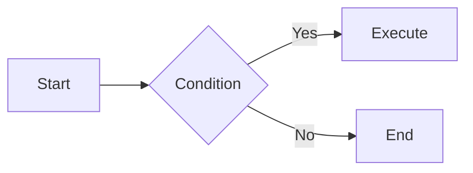

# Markdown Rendering

<BrandName /> fully supports GitHub Flavored Markdown (GFM) in AI responses. Tables, strikethrough, code blocks, and more are rendered beautifully, making information easier to understand.

## Supported Features

### GFM Tables

When AI responds with comparison tables or option lists, they are displayed in a structured format.

```markdown
| Feature | Cline | Careti |
|---------|-------|--------|
| GFM Tables | ❌ | ✅ |
| Strikethrough | ❌ | ✅ |
| Mermaid | ✅ | ✅ |
```

**Rendered Result:**

| Feature | Cline | Careti |
|---------|-------|--------|
| GFM Tables | ❌ | ✅ |
| Strikethrough | ❌ | ✅ |
| Mermaid | ✅ | ✅ |

### Table Alignment

You can specify column alignment in tables:

- `:---` - Left align
- `:---:` - Center align
- `---:` - Right align

```markdown
| Left | Center | Right |
|:-----|:------:|------:|
| L | C | R |
```

### Strikethrough

Use `~~text~~` format to display strikethrough text.

```markdown
~~This text is deleted~~
```

**Rendered Result:** ~~This text is deleted~~

### Mermaid Diagrams

Flowcharts, sequence diagrams, and more are rendered visually.

````markdown

````

### Code Highlighting

Syntax highlighting for various programming languages is supported.

````markdown
```typescript
function greet(name: string): string {
  return `Hello, ${name}!`;
}
```
````

## Differences from Cline

<BrandName /> adds GFM extension support that is not available in the original Cline:

| Feature | Cline | <BrandName /> |
|---------|-------|---------------|
| Basic Markdown | ✅ | ✅ |
| GFM Tables | ❌ raw text | ✅ table rendering |
| Table Alignment | ❌ | ✅ |
| Strikethrough | ❌ raw text | ✅ strikethrough rendering |
| Mermaid | ✅ | ✅ |
| Code Highlighting | ✅ | ✅ |

## Use Cases

### API Comparison

Ask AI "Compare REST API and GraphQL" and receive a clean, tabular response.

### Change History

Clearly display code changes with `~~old code~~` → `new code` format.

### Architecture Explanation

Visualize system architecture, data flows, and more with Mermaid diagrams.

## Technical Information

This feature is implemented using the `remark-gfm` plugin. Version `remark-gfm@1.0.0` is used for compatibility with `react-remark`.
