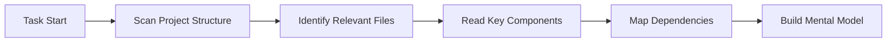

<Info>
**Référence Rapide**

- **Contexte** = Toutes les informations que Careti connaît sur votre projet
- **Fenêtre de contexte** = Quantité maximale d'informations que Careti peut traiter en même temps (varie selon le modèle)
- **Token** = Unité de mesure de texte (~3/4 d'un mot anglais)
- **Auto-gestion** = Careti gère automatiquement le contexte via Focus Chain & Auto Compact
</Info>

## Qu'est-ce que la gestion du contexte ?

La gestion du contexte est la manière dont Careti maintient une compréhension de votre projet tout au long d'une conversation. Considérez-le comme la mémoire partagée entre vous et Careti - contenant le code, les décisions, les exigences et l'avancement.

<Frame caption="Le contexte est comme un espace de travail partagé où Careti construit une compréhension de votre projet">
	
</Frame>

### Les trois couches du contexte

1. **Contexte immédiat** - Conversation actuelle et fichiers actifs
2. **Contexte du projet** - Votre codebase, sa structure et ses modèles
3. **Contexte persistant** - AGENTS.md, .agents/context, caret-docs et work-logs

## Comprendre les fenêtres de contexte

Chaque modèle d'IA a une **fenêtre de contexte** - la quantité maximale d'informations qu'il peut traiter dans une seule conversation. Ceci est mesuré en tokens :

### Limites de Token par modèle

| Model | Context Window | Effective Limit* | Best For |
|-------|---------------|-----------------|----------|
| **Claude 3.5 Sonnet** | 200,000 tokens | 150,000 tokens | Tâches complexes, grandes codebases |
| **Claude 3.5 Haiku** | 200,000 tokens | 150,000 tokens | Réponses plus rapides, tâches plus simples |
| **GPT-4o** | 128,000 tokens | 100,000 tokens | Développement à usage général |
| **Gemini 2.0 Flash** | 1,000,000+ tokens | 400,000 tokens | Très grands contextes |
| **DeepSeek v3** | 64,000 tokens | 50,000 tokens | Codage économique |
| **Qwen 2.5 Coder** | 128,000 tokens | 100,000 tokens | Tâches de codage spécialisées |

*La limite effective est d'environ 75 à 80 % du maximum pour des performances optimales

<Tip>
**Calcul de Tokens simplifié**
- 1 token ≈ 3/4 d'un mot anglais
- 100 tokens ≈ 75 mots ≈ 3-5 lignes de code
- 10,000 tokens ≈ 7,500 mots ≈ ~15 pages de texte
- Un fichier source typique : 500-2 000 tokens
</Tip>

## Comment Careti construit le contexte

La construction d'un contexte efficace est ce qui rend Careti vraiment utile. Lorsque vous démarrez une tâche, Careti n'attend pas passivement les informations - il rassemble activement le contexte de votre projet, pose des questions de clarification si nécessaire et s'adapte à ce qui se passe en temps réel. Cette combinaison de découverte automatique, de guidage de l'utilisateur et d'adaptation dynamique garantit que Careti dispose toujours des bonnes informations pour résoudre efficacement vos problèmes.

### 1. Collecte automatique du contexte

Lorsque vous démarrez une tâche, Careti prend l'initiative de :

**Ce que Careti découvre automatiquement :**
- Structure du projet et organisation des fichiers
- Relations d'importation et dépendances
- Modèles et conventions de code
- Fichiers de configuration et paramètres
- Changements récents et git history (lors de l'utilisation de @git)

### 2. Contexte guidé par l'utilisateur

Bien que la découverte automatique prenne en charge une grande partie du travail, vous contrôlez ce sur quoi Careti se concentre. Plus le contexte que vous fournissez est spécifique et pertinent, mieux Careti peut comprendre vos besoins et fournir des solutions précises.

Vous améliorez le contexte en :
- **@ Mentionnant** des fichiers, des dossiers ou des URL
- **Fournissant des exigences** en langage naturel
- **Partageant des captures d'écran** pour le contexte de l'interface utilisateur
- **Ajoutant de la documentation** via AGENTS.md + .agents/context + caret-docs
- **Répondant aux questions** lorsque Careti a besoin de clarifications

### 3. Adaptation dynamique du contexte

Careti adapte le contexte de manière dynamique tout au long de votre conversation. Il prend en compte la complexité de votre demande, l'espace disponible dans la fenêtre de contexte, l'avancement actuel de la tâche, les messages d'erreur et les commentaires, ainsi que les décisions précédentes prises au cours de la conversation pour déterminer quelles informations sont les plus importantes à chaque étape.

## La barre de progression de la fenêtre de contexte

Surveillez votre utilisation du contexte en temps réel :

<Frame caption="La barre de la fenêtre de contexte affiche l'utilisation des tokens d'entrée/sortie">
	
</Frame>

### Comprendre les indicateurs

- ⬆️ **Tokens d'entrée** : informations envoyées au modèle (vos messages + contexte)
- ⬇️ **Tokens de sortie** : réponses du modèle et code généré
- ➡️ **Tokens de cache** : tokens précédemment traités qui sont réutilisés (réduit les coûts et améliore la vitesse)
- **Barre de progression** : représentation visuelle de l'utilisation
- **Pourcentage** : utilisation actuelle de la capacité totale

## Fonctionnalités de gestion automatique du contexte

Careti comprend des systèmes intelligents qui gèrent le contexte pour vous :

### Focus Chain (Par défaut : ACTIVÉ)

Focus Chain maintient la continuité des tâches grâce à des listes de tâches automatiques. Lorsque vous démarrez une tâche, Careti génère des étapes réalisables et les met à jour à mesure que le travail progresse. Cela maintient le contexte essentiel visible même après l'exécution d'Auto Compact, vous permettant de suivre l'avancement sans faire défiler toute la conversation.

[En savoir plus →](/french/features/focus-chain)

### Auto Compact (Toujours ACTIVÉ)

Lorsque l'utilisation du contexte atteint environ 80 %, Auto Compact crée automatiquement un résumé complet de la conversation. Cela préserve toutes les décisions et les modifications de code tout en libérant de l'espace pour la poursuite du travail. Vous verrez un message lorsque cela se produit. La tâche se poursuit de manière transparente - vous n'avez rien à faire.

[En savoir plus →](/french/features/auto-compact)

### Système de troncation du contexte

Si votre conversation approche de la limite de la fenêtre de contexte du modèle avant l'exécution d'Auto Compact, le gestionnaire de contexte de Careti tronque automatiquement les parties les plus anciennes de la conversation pour éviter les erreurs.

Le système priorise ce qui compte le plus :
- La description de votre tâche d'origine reste
- Les exécutions récentes d'outils et leurs résultats restent intacts
- L'état actuel du code et les erreurs actives sont conservés
- Le flux logique des messages utilisateur-assistant est maintenu

Ce qui est supprimé en premier :
- Historique des conversations redondant du début de la tâche
- Sorties d'outils terminées qui ne sont plus pertinentes
- Étapes de débogage intermédiaires
- Explications détaillées qui ont servi leur objectif

Cela se produit automatiquement. Vous continuerez à travailler sans interruption, et Careti conserve suffisamment de contexte pour continuer à résoudre votre problème efficacement.

## Bonnes pratiques

- **Soyez précis** - Des objectifs clairs aident Careti à comprendre vos besoins
- **Utilisez les @ mentions de manière stratégique** - Faites référence à des fichiers spécifiques plutôt qu'à des dossiers entiers
- **Surveillez la barre de progression** - Jaune/rouge signifie qu'il faut envisager d'utiliser `/smol` ou `/newtask`
- **Faites confiance à l'auto-gestion** - Focus Chain et Auto Compact gèrent automatiquement la complexité
- **Utilisez le Careti Context System** - Gardez AGENTS.md + .agents/context + caret-docs alignés

## Prochaines étapes

<CardGroup cols={2}>
	<Card title="Focus Chain" icon="link" href="/french/features/focus-chain">
		Découvrez comment Focus Chain maintient la continuité des tâches
	</Card>
	<Card title="Auto Compact" icon="compress" href="/french/features/auto-compact">
		Comprendre la compression automatique des conversations
	</Card>
	<Card title="Careti Context System" icon="brain" href="/french/prompting/caret-memory-bank">
		Remplacez Memory Bank par AGENTS.md + .agents/context
	</Card>
	<Card title="Careti Rules" icon="gavel" href="/french/features/caret-rules">
		Définir des conventions spécifiques au projet
	</Card>
</CardGroup>
