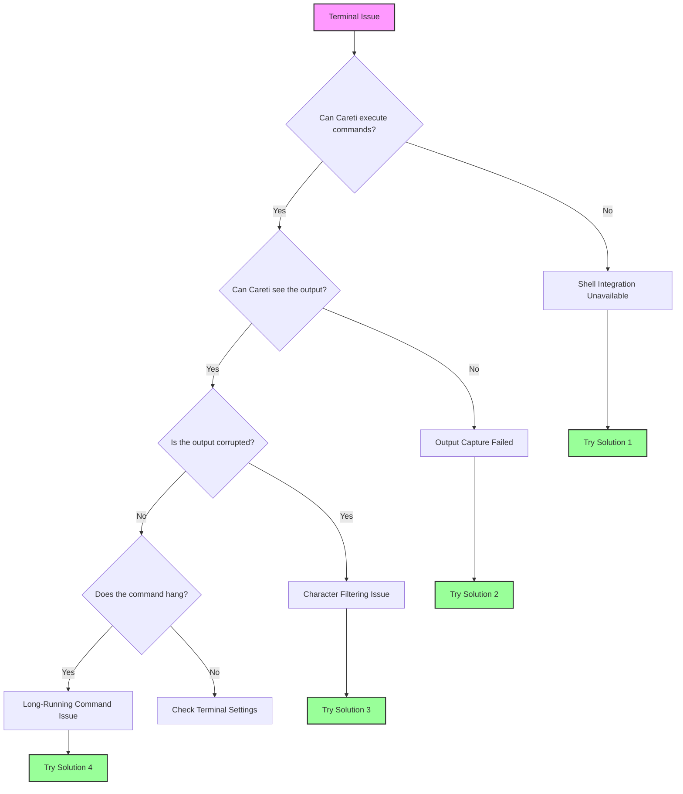

Ce guide vous aide à résoudre les problèmes d'intégration du terminal dans Careti. L'intégration du terminal est cruciale pour que Careti puisse exécuter des commandes et lire leur sortie, lui permettant ainsi de comprendre les erreurs, les résultats de tests et les réponses aux commandes.

<Tip>
	Si vous rencontrez des problèmes de terminal, essayez de passer à un shell plus simple comme `bash` dans les réglages de Careti, sous "Terminal Settings".

    Cela résout la plupart des problèmes d'intégration du terminal.

</Tip>

## Quick Diagnosis Flowchart

Suivez ce diagramme pour identifier rapidement votre problème :



## Problèmes courants et solutions rapides

### 1. Shell Integration Unavailable

**Symptômes :**

-   Message : "Shell Integration Unavailable"
-   Les commandes s'exécutent mais Careti ne peut pas lire la sortie
-   Le terminal fonctionne normalement manuellement mais pas avec Careti

**Solutions rapides :**

#### macOS

-   **Passer à bash**

    1. Allez dans les Careti Settings
    2. Faites un clic gauche sur l'onglet **"Terminal Settings"**
    3. Naviguez vers **"Default Terminal Profile"** et sélectionnez **"bash"** dans le menu déroulant

-   **Désactiver Oh-My-Zsh temporairement** :

    1. Si vous utilisez zsh, tapez `mv ~/.zshrc ~/.zshrc.backup` dans le terminal
    2. Redémarrez VS Code

-   **Configurer l'environnement** :
    1.a Pour les utilisateurs de Zsh, utilisez l'une des commandes Zsh suivantes pour éditer votre profil de shell :

          - `nano ~/.zshrc`
          - `vim ~/.zshrc`
          - `code ~/.zshrc`

    1.b Pour les utilisateurs de Bash :

          - nano ~/.bash_profile

    2. Ajoutez ce qui suit à votre configuration de shell : `export TERM=xterm-256color`
    3. Sauvegardez votre configuration

#### Windows

-   **Utiliser PowerShell 7**

    1. Installez-le depuis le Microsoft Store
    2. Allez dans les Careti Settings
    3. Faites un clic gauche sur l'onglet **"Terminal Settings"**
    4. Naviguez vers **"Default Terminal Profile"** et sélectionnez **"PowerShell 7"** dans le menu déroulant

-   **Désactiver Windows ConPTY**

    1. Allez dans vos réglages VS Code
    2. Entrez "Integrated: Windows Enable Conpty" dans la barre de recherche des réglages
    3. Décochez l'option

-   **Essayer l'Invite de commandes (Command Prompt)**
    1. Allez dans les Careti Settings
    2. Faites un clic gauche sur l'onglet **"Terminal Settings"**
    3. Naviguez vers **"Default Terminal Profile"** et sélectionnez **"Command Prompt"** dans le menu déroulant

#### Linux

-   **Utiliser bash**

    1. Allez dans les Careti Settings
    2. Faites un clic gauche sur l'onglet **"Terminal Settings"**
    3. Naviguez vers **"Default Terminal Profile"** et sélectionnez **"bash"** dans le menu déroulant

-   **Vérifier les permissions**

    1. Assurez-vous que VS Code possède les permissions d'accès au terminal

-   **Désactiver les prompts personnalisés**
    1. Mettez en commentaire les personnalisations de prompt dans le fichier `.bashrc`

### 2. Sortie de commande non visible

**Symptômes :**

-   Careti indique dans le chat : "[Command is running but producing no output]"
-   Les commandes se terminent mais Careti ne voit pas les résultats
-   Les commandes fonctionnent parfois, mais pas de manière cohérente

**Solutions :**

-   **Augmenter le Shell Integration Timeout**

    1. Dans Careti, faites un clic gauche sur le bouton **Settings** dans le coin supérieur droit de la fenêtre de chat
    2. Une fois dans la fenêtre **Settings**, faites un clic gauche sur l'onglet **"Terminal Settings"** dans la colonne de gauche
    3. Naviguez vers "Shell integration timeout (seconds)" et entrez **"10"** dans le champ texte

-   **Désactiver la réutilisation du terminal (Terminal Reuse)**

    1. Dans Careti, faites un clic gauche sur le bouton **Settings** dans le coin supérieur droit de la fenêtre de chat
    2. Une fois dans la fenêtre **Settings**, faites un clic gauche sur l'onglet **"Terminal Settings"** dans la colonne de gauche
    3. Cherchez l'option **"Enable aggressive terminal reuse"** et **décochez-la**

-   **Vérifier les extensions interférant**
    1. Désactivez les autres extensions VS Code liées au terminal

### 3. Problèmes de filtrage de caractères

**Symptômes :**

-   Virgules manquantes dans la sortie (le JSON semble corrompu)
-   Caractères spéciaux supprimés de la sortie du terminal
-   Erreurs de syntaxe qui n'apparaissent pas lors d'une exécution manuelle

**Solution :**
Il s'agit d'un bug connu dans le traitement de la sortie. Solutions de contournement :

-   Recommander à l'AI d'utiliser une sortie dans un fichier à la place
    1. Dites à Careti dans le chat ou via les Careti rules d'utiliser `command > output.txt` avant de lire le ou les fichiers

<Tip>
	Cette famille de problèmes n'est que partiellement résolue dans les dernières versions de Careti. Si vous y faites toujours face de manière persistante, créez une issue sur GitHub.
</Tip>

### 4. Commandes longues et barres de progression

**Symptômes :**

-   Les builds Docker ne se terminent jamais dans Careti
-   Les barres de progression consomment des milliers de tokens
-   Le bouton Careti "Proceed while running" ne fonctionne pas correctement dans le chat

<Tip>
	Cette famille de problèmes a été résolue dans les dernières versions de Careti, mais si vous rencontrez encore des soucis, créez une issue GitHub à ce sujet.
</Tip>

## Explication des Terminal Settings

Accédez à ces réglages dans Careti en cliquant sur l'icône de paramètres, puis en naviguant vers la section "Terminal Settings" :

### Default Terminal Profile

-   **Ce que cela fait** : Sélectionne le shell utilisé par Careti pour les commandes
-   **Quand le changer** : Si vous rencontrez des problèmes de Shell Integration avec votre shell par défaut
-   **Recommandé** : - macOS : bash (si zsh a des problèmes) - Windows : PowerShell 7 - Linux : bash

### Shell Integration Timeout

-   **Ce que cela fait** : Temps pendant lequel Careti attend que le terminal soit prêt
-   **Par défaut** : 4 secondes
-   **Quand l'augmenter** :
    -   Démarrage lent du shell (fichiers .zshrc/.bashrc lourds)
    -   Environnements WSL
    -   Connexions SSH
-   **Recommandé** : - Commencez par 10 secondes en cas de problème

### Enable Aggressive Terminal Reuse

-   **Ce que cela fait** : Réutilise les terminaux existants même s'ils ne sont pas dans le bon répertoire
-   **Quand le désactiver** :
    -   Les commandes s'exécutent dans le mauvais répertoire
    -   Problèmes d'environnements virtuels
    -   Corruption de l'état du terminal
-   **Compromis** : - La désactivation crée plus de terminaux mais garantit un état propre

### Terminal Output Line Limit

-   **Ce que cela fait** : Limite le nombre de lignes que Careti lit depuis la sortie du terminal
-   **Par défaut** : 500 lignes
-   **Quand l'ajuster** :
    -   Augmentez pour des sorties de build verbeuses
    -   Diminuez si vous atteignez les limites de tokens
    -   Réglez à 100 pour les commandes avec des barres de progression

## Solutions spécifiques aux plateformes

### Problèmes macOS

#### Conflits Oh-My-Zsh

Oh-My-Zsh interfère souvent avec Shell Integration. Solutions :

1. Créez un `.zshrc` minimal pour VS Code :
    ```bash
    # ~/.zshrc-vscode
    export TERM=xterm-256color
    export PAGER=cat
    # Minimal PATH and environment setup
    ```
2. Configurez VS Code pour l'utiliser :
    ```json
    {
    	"terminal.integrated.env.osx": {
    		"ZDOTDIR": "~/.zshrc-vscode"
    	}
    }
    ```

#### Problèmes macOS 15+

Les versions récentes de macOS ont des permissions de terminal plus strictes :

1. Réglages Système → Confidentialité et sécurité → Outils de développement
2. Ajoutez Visual Studio Code
3. Redémarrez complètement VS Code

### Problèmes Windows

Si vous utilisez Windows et que vous rencontrez toujours des problèmes de Shell Integration après avoir essayé les étapes précédentes, il est recommandé d'utiliser Git Bash (ou PowerShell).

### Git Bash

Git Bash est un émulateur de terminal qui offre une expérience de ligne de commande de type Unix sur Windows. Pour utiliser Git Bash, vous devez :

1. Télécharger et exécuter l'installateur Git for Windows depuis [https://git-scm.com/downloads/win](https://git-scm.com/downloads/win)
2. Quitter et rouvrir VS Code
3. Appuyer sur `Ctrl + Shift + P` pour ouvrir la Palette de commandes
4. Taper "Terminal: Select Default Profile" et le choisir
5. Sélectionner "Git Bash"

### PowerShell

Si vous souhaitez toujours utiliser PowerShell, assurez-vous d'utiliser une version à jour (au moins v7+).
  - Vérifiez votre version actuelle de PowerShell en exécutant : `$PSVersionTable.PSVersion`
  - Si votre version est inférieure à 7, [mettez à jour PowerShell](https://learn.microsoft.com/en-us/powershell/scripting/whats-new/migrating-from-windows-powershell-51-to-powershell-7?view=powershell-7.4#installing-powershell-7).

Vous devrez peut-être également ajuster votre politique d'exécution PowerShell. Par défaut, PowerShell restreint l'exécution de scripts pour des raisons de sécurité.

#### Comprendre les PowerShell Execution Policies

PowerShell utilise des politiques d'exécution pour déterminer quels scripts peuvent s'exécuter sur votre système. Voici les politiques les plus courantes :

- `Restricted` : Aucun script PowerShell ne peut s'exécuter. C'est le réglage par défaut.
- `AllSigned` : Tous les scripts, y compris les scripts locaux, doivent être signés par un éditeur de confiance.
- `RemoteSigned` : Les scripts créés localement peuvent s'exécuter, mais les scripts téléchargés depuis Internet doivent être signés.
- `Unrestricted` : Aucune restriction. N'importe quel script peut s'exécuter, bien qu'un avertissement s'affiche avant d'exécuter des scripts téléchargés sur Internet.

Pour le travail de développement dans VS Code, la politique `RemoteSigned` est généralement recommandée. Elle permet aux scripts créés localement de s'exécuter sans restriction tout en maintenant la sécurité pour les scripts téléchargés. Pour en savoir plus sur les politiques d'exécution PowerShell et comprendre les implications de sécurité, consultez la documentation de Microsoft : [About Execution Policies](https://learn.microsoft.com/en-us/powershell/module/microsoft.powershell.core/about/about_execution_policies).

#### Étapes pour modifier la politique d'exécution

1. Ouvrez PowerShell en tant qu'administrateur : Appuyez sur `Win + X` et sélectionnez "Windows PowerShell (Administrator)" ou "Windows Terminal (Administrator)".

2. Vérifiez la politique d'exécution actuelle en exécutant cette commande :
     ```powershell
     Get-ExecutionPolicy
     ```
   - Si la sortie est déjà `RemoteSigned`, `Unrestricted` ou `Bypass`, vous n'avez probablement pas besoin de la changer. Ces politiques devraient permettre à Shell Integration de fonctionner.
   - Si la sortie est `Restricted` ou `AllSigned`, vous devrez peut-être changer votre politique pour activer Shell Integration.

3. Modifiez la politique d'exécution en exécutant la commande suivante :
     ```powershell
     Set-ExecutionPolicy RemoteSigned -Scope CurrentUser
     ```
   - Cela définit la politique sur `RemoteSigned` pour l'utilisateur actuel uniquement, ce qui est plus sûr que de la changer au niveau du système entier.

4. Confirmez le changement en tapant `Y` et en appuyant sur Entrée lorsque vous y êtes invité.

5. Vérifiez le changement de politique en exécutant à nouveau `Get-ExecutionPolicy` pour confirmer le nouveau réglage.

6. Redémarrez VS Code et réessayez Shell Integration.


#### Intégration WSL

Pour les problèmes liés à WSL :

1. Utilisez l'extension WSL pour VS Code
2. Ouvrez le dossier dans WSL : `code .` depuis le terminal WSL
3. Sélectionnez "WSL Bash" comme profil de terminal dans Careti

#### Problèmes de chemins (Paths)

Problèmes de chemins sur Windows :

1. Utilisez des barres obliques (forward slashes) dans Careti : `C:/Users/...`
2. Mettez les chemins contenant des espaces entre guillemets : `"C:/Program Files/..."`
3. Évitez `~` - utilisez des chemins complets

### Problèmes Linux/SSH/Containers

#### Connexions SSH

Pour le développement à distance :

1. Installez Careti sur la machine distante, pas localement
2. Utilisez le terminal intégré de l'extension SSH
3. Augmentez le timeout à plus de 15 secondes

#### Containers Docker

Lors du développement dans des containers :

1. Installez Careti dans le container
2. Utilisez l'extension Dev Containers
3. Assurez-vous que les scripts de Shell Integration sont disponibles

## Correctifs spécifiques au Shell

### Zsh

```bash
# Ajouter à ~/.zshrc
export TERM=xterm-256color
export PAGER=cat
# Disable fancy prompts for VSCode
if [[ "$TERM_PROGRAM" == "vscode" ]]; then
    PS1="%n@%m %1~ %# "
fi
```

### Bash

```bash
# Ajouter à ~/.bashrc
export TERM=xterm-256color
export PAGER=cat
# Simple prompt for VSCode
if [[ "$TERM_PROGRAM" == "vscode" ]]; then
    PS1='\u@\h:\w\$ '
fi
```

### Fish

```fish
# Ajouter à ~/.config/fish/config.fish
set -x TERM xterm-256color
set -x PAGER cat
# Disable fancy features in VSCode
if test "$TERM_PROGRAM" = "vscode"
    function fish_prompt
        echo (whoami)'@'(hostname)':'(pwd)'> '
    end
end
```

### PowerShell

```powershell
# Ajouter à $PROFILE
$env:PAGER = "cat"
# Disable progress bars
$ProgressPreference = 'SilentlyContinue'
```

## Dépannage avancé

### Mode Debug

Activez le débogage du terminal pour voir ce qui se passe :

1. Ouvrez la Palette de commandes de VS Code (Cmd/Ctrl+Shift+P)
2. Exécutez : "Developer: Set Log Level..."
3. Choisissez "Trace"
4. Vérifiez le panneau Output → "Careti" pour les logs du terminal

### Test manuel de Shell Integration

Testez si Shell Integration fonctionne :

```bash
# Dans le terminal VSCode
echo $TERM_PROGRAM  # Devrait afficher "vscode"
echo $VSCODE_SHELL_INTEGRATION  # Devrait être "1"
```

## FAQ

### Pourquoi Careti crée-t-il autant de terminaux ?

Lorsque Shell Integration échoue, Careti ne peut pas réutiliser les terminaux en toute sécurité (ils pourraient exécuter des processus longs). Activez Shell Integration ou ajustez le réglage de réutilisation du terminal.

### Puis-je utiliser mon shell personnalisé (nushell, xonsh, etc.) ?

Careti supporte officiellement bash, zsh, fish et PowerShell. Les shells personnalisés peuvent fonctionner mais ne sont pas garantis. Utilisez bash comme solution de repli.

### Pourquoi certaines commandes fonctionnent-elles et d'autres non ?

Les commandes qui utilisent des fonctionnalités interactives (pagers, barres de progression, curses) échouent souvent. Définissez `PAGER=cat` et utilisez des drapeaux (flags) non interactifs.

### Comment savoir si Shell Integration fonctionne ?

Une intégration fonctionnelle affiche la sortie de la commande dans le chat de Careti. Une intégration échouée affiche "Shell Integration Unavailable" ou "[Command is running but producing no output]".

## Vous avez toujours des problèmes ?

Si vous avez tout essayé :

1. **Collectez les infos de Debug** :

    ```bash
    echo "Shell: $SHELL"
    echo "Term: $TERM"
    echo "VSCode: $TERM_PROGRAM"
    which bash
    bash --version
    ```

2. **Signalez le problème** :
    - Utilisez `/reportbug` dans les issues GitHub de Careti
    - Incluez vos infos de debug
    - Mentionnez les solutions que vous avez essayées

<Tip>
	Rappel : La plupart des problèmes de terminal sont résolus en passant à bash et en augmentant le timeout. Commencez par là avant d'essayer des solutions complexes.
</Tip>