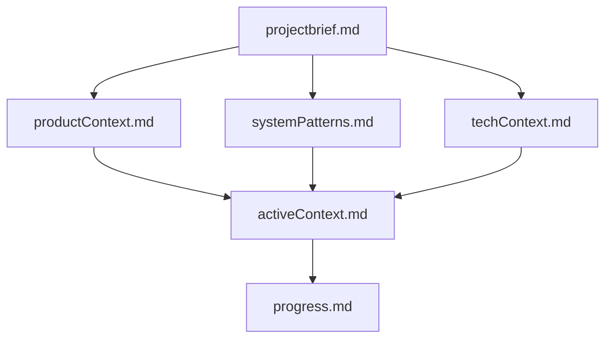
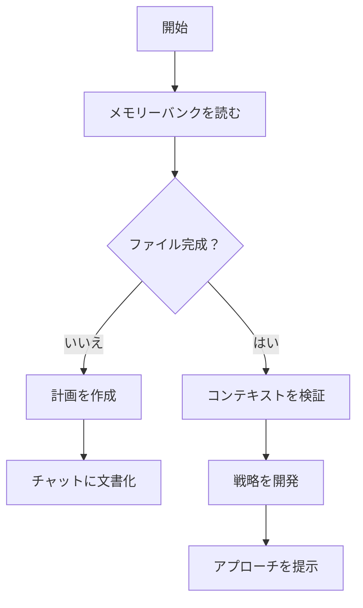
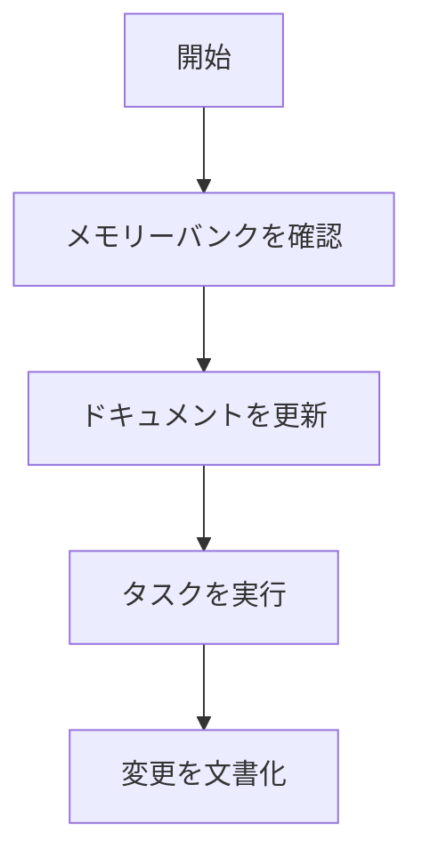
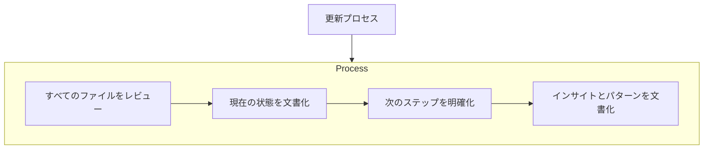

## Caretメモリーバンク完全ガイド

### クイックセットアップガイド

Caretメモリーバンクを開始するには：

1. **CaretをインストールまたはOPEN**
2. **カスタム指示をコピー** - 下のコードブロックを使用
3. **Caretに貼り付け** - カスタム指示または.clinerules fileに追加
4. **初期化** - Caretに「initialize memory bank」を依頼

[詳細なセットアップ手順を参照](#getting-started-with-memory-bank)

### Caretメモリーバンクカスタム指示 \[これをコピー]

```
# Caretのメモリーバンク

私はCaret、エキスパートソフトウェアエンジニアです。私には独特の特性があります：私のメモリはセッション間で完全にリセットされます。これは制限ではありません - これが完璧なドキュメントを維持する原動力です。各リセット後、私はメモリーバンクに完全に依存してプロジェクトを理解し、効果的に作業を続行します。すべてのタスクの開始時にすべてのメモリーバンクファイルを読み取る必要があります - これはオプションではありません。

## メモリーバンク構造

メモリーバンクは、コアファイルとオプションのコンテキストファイルで構成され、すべてMarkdown形式です。ファイルは明確な階層で相互に構築されます：



### コアファイル（必須）
1. `projectbrief.md`
   - 他のすべてのファイルを形成する基礎ドキュメント
   - 存在しない場合はプロジェクト開始時に作成
   - コア要件と目標を定義
   - プロジェクトスコープの信頼できる情報源

2. `productContext.md`
   - このプロジェクトが存在する理由
   - 解決する問題
   - どのように機能すべきか
   - ユーザーエクスペリエンスの目標

3. `activeContext.md`
   - 現在の作業フォーカス
   - 最近の変更
   - 次のステップ
   - アクティブな決定と考慮事項
   - 重要なパターンと設定
   - 学習とプロジェクトインサイト

4. `systemPatterns.md`
   - システムアーキテクチャ
   - 主要な技術的決定
   - 使用中のデザインパターン
   - コンポーネント関係
   - 重要な実装パス

5. `techContext.md`
   - 使用される技術
   - 開発セットアップ
   - 技術的制約
   - 依存関係
   - ツール使用パターン

6. `progress.md`
   - 機能するもの
   - 構築が残っているもの
   - 現在の状態
   - 既知の問題
   - プロジェクト決定の進化

### 追加コンテキスト
以下を整理するのに役立つ場合、memory-bank/内に追加のファイル/フォルダーを作成：
- 複雑な機能ドキュメント
- 統合仕様
- APIドキュメント
- テスト戦略
- デプロイメント手順

## コアワークフロー

### プランモード


### アクトモード


## ドキュメント更新

メモリーバンクの更新が発生するタイミング：
1. 新しいプロジェクトパターンの発見
2. 重要な変更の実装後
3. ユーザーが**update memory bank**でリクエストした場合（すべてのファイルをレビューする必要があります）
4. コンテキストに明確化が必要な場合



注：**update memory bank**によってトリガーされた場合、一部が更新を必要としない場合でも、すべてのメモリーバンクファイルをレビューする必要があります。特にactiveContext.mdとprogress.mdに焦点を当ててください。これらは現在の状態を追跡します。

覚えておいてください：すべてのメモリリセット後、私は完全に新鮮に始まります。メモリーバンクは以前の作業への唯一のリンクです。私の効果性はその正確性に完全に依存しているため、正確さと明確さで維持する必要があります。
```

### Caretメモリーバンクとは？

メモリーバンクは、Caretがセッション間でコンテキストを維持できるようにする構造化されたドキュメントシステムです。Caretをステートレスアシスタントから、時間の経過とともにプロジェクトの詳細を効果的に「記憶」できる永続的な開発パートナーに変換します。

#### 主な利点

-   **コンテキストの保存**：セッション間でプロジェクト知識を維持
-   **一貫した開発**：Caretとの予測可能な対話を体験
-   **自己文書化プロジェクト**：副作用として貴重なプロジェクトドキュメントを作成
-   **任意のプロジェクトにスケーラブル**：任意のサイズまたは複雑さのプロジェクトで動作
-   **技術に依存しない**：任意の技術スタックまたは言語で機能

### メモリーバンクの仕組み

メモリーバンクはCaret固有の機能ではありません - 構造化されたドキュメントを通じてAIコンテキストを管理するための方法論です。Caretに「カスタム指示に従う」ように指示すると、メモリーバンクファイルを読み取ってプロジェクトの理解を再構築します。

<figure>
	
</figure>

#### ファイルの理解

メモリーバンクファイルは、プロジェクトに作成する単なるMarkdownファイルです。隠されたファイルや特別なファイルではありません - あなたとCaretの両方がアクセスできる、リポジトリに保存された通常のドキュメントです。

ファイルは、プロジェクトの完全な全体像を構築する階層構造で整理されています：

<figure>
	
</figure>

### メモリーバンクファイルの説明

#### コアファイル

1. **projectbrief.md**
    - プロジェクトの基礎
    - 構築しているものの高レベル概要
    - コア要件と目標
    - 例：「バーコードスキャン機能を備えた在庫管理用のReact Webアプリを構築」
2. **productContext.md**
    - プロジェクトが存在する理由を説明
    - 解決されている問題を説明
    - 製品がどのように機能すべきかを概説
    - 例：「在庫システムは複数の倉庫とリアルタイム更新をサポートする必要があります」
3. **activeContext.md**
    - 最も頻繁に更新されるファイル
    - 現在の作業フォーカスと最近の変更を含む
    - アクティブな決定と考慮事項を追跡
    - 重要なパターンと学習を保存
    - 例：「現在バーコードスキャナーコンポーネントを実装中；前回のセッションでAPI統合を完了」
4. **systemPatterns.md**
    - システムアーキテクチャを文書化
    - 主要な技術的決定を記録
    - 使用中のデザインパターンをリスト
    - コンポーネント関係を説明
    - 例：「正規化されたストア構造でReduxを使用して状態管理」
5. **techContext.md**
    - 使用される技術とフレームワークをリスト
    - 開発セットアップを説明
    - 技術的制約を記録
    - 依存関係とツール設定を記録
    - 例：「React 18、TypeScript、Firebase、テスト用のJest」
6. **progress.md**
    - 機能するものと構築が残っているものを追跡
    - 機能の現在の状態を記録
    - 既知の問題と制限をリスト
    - プロジェクト決定の進化を文書化
    - 例：「ユーザー認証完了；在庫管理80%完了；レポート未開始」

#### 追加コンテキスト

必要に応じて追加のファイルを作成して整理：

-   複雑な機能ドキュメント
-   統合仕様
-   APIドキュメント
-   テスト戦略
-   デプロイメント手順

### メモリーバンクの開始

#### 初回セットアップ

1. プロジェクトルートに`memory-bank/`フォルダーを作成
2. 基本的なプロジェクトブリーフを準備（技術的または非技術的）
3. Caretに「initialize memory bank」を依頼

<figure>
	
</figure>

#### プロジェクトブリーフのヒント

-   シンプルに始める - 詳細でも高レベルでも好きなように
-   最も重要なことに焦点を当てる
-   Caretがギャップを埋めて質問するのを手伝う
-   プロジェクトが進化するにつれて更新できます

### Caretとの作業

#### コアワークフロー

**プランモード**

戦略的な議論と高レベルの計画のためにこのモードで開始します。

**アクトモード**

実装と特定のタスクの実行にこれを使用します。

#### 主要なコマンド

-   **「follow your custom instructions」** - これにより、Caretはメモリーバンクファイルを読み取り、中断したところから続行します（タスクの開始時に使用）
-   **「initialize memory bank」** - 新しいプロジェクトを開始するときに使用
-   **「update memory bank」** - タスク中に完全なドキュメントのレビューと更新をトリガー
-   現在のニーズに基づいてプラン/アクトモードを切り替え

#### ドキュメント更新

メモリーバンクの更新は、以下の場合に自動的に発生する必要があります：

1. プロジェクトで新しいパターンを発見
2. 重要な変更の実装後
3. **「update memory bank」**で明示的にリクエストした場合
4. コンテキストに明確化が必要と感じた場合

### よくある質問

#### メモリーバンクファイルはどこに保存されますか？

メモリーバンクファイルは、通常`memory-bank/`フォルダーにプロジェクトリポジトリに保存された通常のMarkdownファイルです。隠されたシステムファイルではありません - プロジェクトドキュメントの一部として設計されています。

#### カスタム指示または.clineruleを使用する必要がありますか？

どちらのアプローチも機能します - 好みに基づいています：

-   **カスタム指示**：すべてのCaret会話にグローバルに適用されます。すべてのプロジェクトで一貫した動作に適しています。
-   **.clinerules file**：プロジェクト固有でリポジトリに保存されます。プロジェクトごとのカスタマイズに適しています。

両方の方法は同じ目標を達成します - 選択は、メモリーバンクシステムのグローバルまたはローカル適用を希望するかどうかによって異なります。

#### コンテキストウィンドウの管理

Caretで作業すると、コンテキストウィンドウは最終的に満杯になります（プログレスバーに注意）。Caretの応答が遅くなったり、会話の以前の部分への参照があまり正確でなくなったりした場合、以下を行う時期です：

1. Caretに**「update memory bank」**を依頼して現在の状態を文書化
2. 新しい会話/タスクを開始
3. 新しい会話でCaretに**「follow your custom instructions」**を依頼

このワークフローにより、コンテキストウィンドウがクリアされる前に重要なコンテキストがメモリーバンクファイルに保存され、新しい会話でシームレスに続行できます。

<figure>
	
</figure>

#### メモリーバンクはどのくらいの頻度で更新する必要がありますか？

重要なマイルストーンまたは方向性の変更後にメモリーバンクを更新します。アクティブな開発の場合、数セッションごとの更新が役立ちます。すべてのコンテキストが保存されていることを確認したい場合は、**「update memory bank」**コマンドを使用します。ただし、Caretも自動的にメモリーバンクを更新することに気付くでしょう。

#### これはCaret以外の他のAIツールでも機能しますか？

はい！メモリーバンクの概念は、ドキュメントファイルを読み取ることができる任意のAIアシスタントで機能するドキュメント方法論です。特定のコマンドは異なる場合がありますが、コンテキストを維持するための構造化されたアプローチはツール全体で機能します。

#### メモリーバンクはコンテキストウィンドウの制限とどのように関係しますか？

メモリーバンクは、必要に応じて効率的にロードできる構造化された形式で重要な情報を保存することにより、コンテキストの制限を管理するのに役立ちます。これにより、重要な情報が利用可能であることを確保しながら、コンテキストの肥大化を防ぎます。

#### メモリーバンクの概念は非コーディングプロジェクトに使用できますか？

もちろん！メモリーバンクアプローチは、構造化されたドキュメントから恩恵を受ける任意のプロジェクトに機能します - 本の執筆からイベントの計画まで。ファイル構造は異なる場合がありますが、概念は強力です。

#### これはREADMEファイルの使用とは異なりますか？

概念的には似ていますが、メモリーバンクはAIセッション間でコンテキストを維持するために特別に設計された、より構造化された包括的なアプローチを提供します。単一のREADMEが通常カバーするものを超えています。

### ベストプラクティス

#### 開始

-   基本的なプロジェクトブリーフから始めて、構造を進化させる
-   Caretに初期構造の作成を手伝わせる
-   ワークフローに合わせてファイルをレビューおよび調整

#### 継続的な作業

-   作業しながらパターンが自然に現れるようにする
-   ドキュメントの更新を強制しない - 有機的に発生する必要があります
-   プロセスを信頼 - 価値は時間とともに複利
-   セッションの開始時にコンテキストの確認を監視

#### ドキュメントフロー

-   **projectbrief.md**があなたの基礎です
-   **activeContext.md**が最も頻繁に変更されます
-   **progress.md**がマイルストーンを追跡します
-   すべてのファイルが共同でプロジェクトインテリジェンスを維持します

### 詳細なセットアップ手順

#### カスタム指示の場合（グローバル）

1. VSCodeを開く
2. Caret拡張機能設定⚙️をクリック
3. 「Custom Instructions」を見つける
4. このガイドの上部から完全なメモリーバンク指示をコピーして貼り付け

#### .clineruleの場合（プロジェクト固有）

1. プロジェクトルートに`.clinerules`ファイルを作成
2. このガイドの上部からメモリーバンク指示をコピーして貼り付け
3. ファイルを保存
4. Caretはこのプロジェクトで作業する際にこれらのルールを自動的に適用します

### 覚えておいてください

メモリーバンクは、Caretの以前の作業への唯一のリンクです。その効果性は、明確で正確なドキュメントを維持し、すべてのインタラクションでコンテキストの保存を確認することに完全に依存しています。

_詳細については、_ [_blog_](https://caret.bot/blog/memory-bank-how-to-make-caret-an-ai-agent-that-never-forgets) _on Caret Memory Bankを参照してください_

---

### Caretメモリーバンクへの貢献

このガイドは、CaretとCaret Discordコミュニティによって維持されています：

-   nickbaumann98
-   Krylo
-   snipermunyshotz

---

_メモリーバンク方法論は、AIコンテキスト管理へのオープンなアプローチであり、異なるツールとワークフローに適応できます。_
