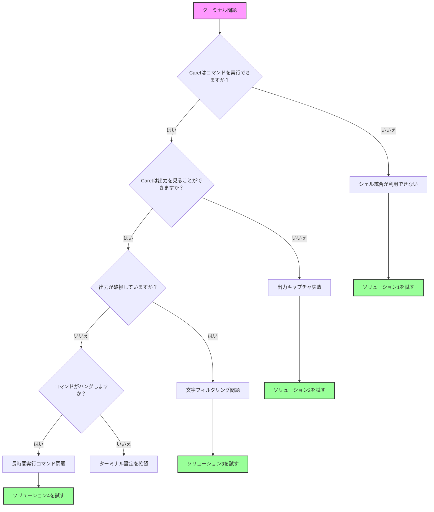

このガイドは、<BrandName />のターミナル統合問題を解決するのに役立ちます。ターミナル統合は、<BrandName />がコマンドを実行し、その出力を読み取るために不可欠であり、エラー、テスト結果、コマンド応答を理解できるようにします。

<Tip>
	ターミナルの問題が発生している場合は、<BrandName />設定の「Terminal Settings」で`bash`のようなシンプルなシェルに切り替えてみてください

    これにより、ほとんどのターミナル統合問題が解決されます。

</Tip>

## クイック診断フローチャート

このフローチャートに従って、問題を迅速に特定します：



## 一般的な問題とクイックソリューション

### 1. シェル統合が利用できない

**症状：**

-   メッセージ：「Shell Integration Unavailable」
-   コマンドは実行されるが<BrandName />は出力を読み取れない
-   ターミナルは手動では正常に動作するが<BrandName />では動作しない

**クイックソリューション：**

#### macOS

-   **bashに切り替える**

    1. <BrandName />設定に移動
    2. **「Terminal Settings」**タブを左クリック
    3. **「Default Terminal Profile」**に移動し、ドロップダウンメニューから**「bash」**を選択

-   **Oh-My-Zshを一時的に無効にする**：

    1. zshを使用している場合、ターミナルに`mv ~/.zshrc ~/.zshrc.backup`を入力
    2. VSCodeを再起動

-   **環境を設定**：
    1.a Zshユーザーの場合、以下のZshコマンドのいずれかを使用してシェルプロファイルを編集：

          - `nano ~/.zshrc`
          - `vim ~/.zshrc`
          - `code ~/.zshrc`

    1.b Bashユーザーの場合

          - nano ~/.bash_profile

    2. シェル設定に以下を追加：`export TERM=xterm-256color`
    3. 設定を保存

#### Windows

-   **PowerShell 7を使用**

    1. Microsoft Storeからインストール
    2. <BrandName />設定に移動
    3. **「Terminal Settings」**タブを左クリック
    4. **「Default Terminal Profile」**に移動し、ドロップダウンメニューから**「PowerShell 7」**を選択

-   **Windows ConPTYを無効にする**

    1. VSCode設定に移動
    2. 設定検索バーに「Integrated: Windows Enable Conpty」を入力
    3. オプションのチェックを外す

-   **コマンドプロンプトを試す**
    1. <BrandName />設定に移動
    2. **「Terminal Settings」**タブを左クリック
    3. **「Default Terminal Profile」**に移動し、ドロップダウンメニューから**「Command Prompt」**を選択

#### Linux

-   **bashを使用**

    1. <BrandName />設定に移動
    2. **「Terminal Settings」**タブを左クリック
    3. **「Default Terminal Profile」**に移動し、ドロップダウンメニューから**「bash」**を選択

-   **権限を確認**

    1. VSCodeにターミナルアクセス権限があることを確認

-   **カスタムプロンプトを無効にする**
    1. `.bashrc`内のプロンプトカスタマイズをコメントアウト

### 2. コマンド出力が表示されない

**症状：**

-   <BrandName />がチャットで述べる：「[Command is running but producing no output]」
-   コマンドは完了するが<BrandName />は結果を見ることができない
-   コマンドが時々動作するが一貫性がない

**ソリューション：**

-   **シェル統合タイムアウトを増やす**

    1. <BrandName />内で、チャットウィンドウの右上隅にある**Settings**ボタンを左クリック
    2. **Settings**ウィンドウに入ったら、左側の列から**「Terminal Settings」**タブを左クリック
    3. 「Shell integration timeout (seconds)」に移動し、テキストフィールドに**「10」**を入力

-   **ターミナル再利用を無効にする**

    1. <BrandName />内で、チャットウィンドウの右上隅にある**Settings**ボタンを左クリック
    2. **Settings**ウィンドウに入ったら、左側の列から**「Terminal Settings」**タブを左クリック
    3. **「Enable aggressive terminal reuse」**を探し、このオプションの**チェックを外す**

-   **干渉する拡張機能を確認**
    1. 他のターミナル関連のVSCode拡張機能を無効にする

### 3. 文字フィルタリング問題

**症状：**

-   出力からカンマが欠落（JSONが破損して表示される）
-   ターミナル出力から特殊文字が削除される
-   手動で実行すると表示されない構文エラー

**ソリューション：**
これは出力処理の既知のバグです。回避策：

-   AIにファイル出力の使用を推奨
    1. チャットまたは<BrandName />ルールで<BrandName />に、ファイルを読み取る前に`command > output.txt`を使用するように指示

<Tip>
	この問題ファミリーは最新の<BrandName />バージョンで部分的にのみ解決されているため、まだこの問題に直面している場合は、持続的な問題である場合はGitHub issueを作成してください。
</Tip>

### 4. 長時間実行コマンドとプログレスバー

**症状：**

-   Dockerビルドがcaretで完了しない
-   プログレスバーが数千のトークンを消費する
-   チャット内の<BrandName />ボタン「Proceed while running」が正常に動作しない

<Tip>
	この問題ファミリーは最新の<BrandName />バージョンで解決されていますが、まだ問題が発生する場合は、GitHub issueを作成してください。
</Tip>

## ターミナル設定の説明

設定アイコンをクリックし、「Terminal Settings」セクションに移動して<BrandName />でこれらにアクセスします：

### デフォルトターミナルプロファイル

-   **機能**：<BrandName />がコマンドに使用するシェルを選択
-   **変更するタイミング**：デフォルトシェルでシェル統合問題が発生している場合
-   **推奨**：- macOS：bash（zshに問題がある場合）- Windows：PowerShell 7 - Linux：bash

### シェル統合タイムアウト

-   **機能**：<BrandName />がターミナルの準備を待機する時間
-   **デフォルト**：4秒
-   **増やすタイミング**：
    -   シェル起動が遅い（重い.zshrc/.bashrc）
    -   WSL環境
    -   SSH接続
-   **推奨**：- 問題がある場合は10秒から始める

### Enable Aggressive Terminal Reuse

-   **機能**：正しいディレクトリにいない場合でも既存のターミナルを再利用
-   **無効にするタイミング**：
    -   コマンドが間違ったディレクトリで実行される
    -   仮想環境の問題
    -   ターミナル状態の破損
-   **トレードオフ**：- 無効にするとより多くのターミナルを作成するが、クリーンな状態を確保

### ターミナル出力行制限

-   **機能**：<BrandName />がターミナル出力から読み取る行数を制限
-   **デフォルト**：500行
-   **調整するタイミング**：
    -   詳細なビルド出力のために増やす
    -   トークン制限に達する場合は減らす
    -   プログレスバーのあるコマンドには100に設定

## プラットフォーム固有のソリューション

### macOSの問題

#### Oh-My-Zshの競合

Oh-My-Zshはしばしばシェル統合を妨害します。ソリューション：

1. VSCode用の最小限の`.zshrc`を作成：
    ```bash
    # ~/.zshrc-vscode
    export TERM=xterm-256color
    export PAGER=cat
    # 最小限のPATHと環境セットアップ
    ```
2. VSCodeを設定して使用：
    ```json
    {
    	"terminal.integrated.env.osx": {
    		"ZDOTDIR": "~/.zshrc-vscode"
    	}
    }
    ```

#### macOS 15+の問題

最近のmacOSバージョンはより厳格なターミナル権限を持っています：

1. システム環境設定 → プライバシーとセキュリティ → 開発者ツール
2. Visual Studio Codeを追加
3. VSCodeを完全に再起動

### Windowsの問題

Windowsを使用していて、前の手順を試した後もシェル統合に問題がある場合は、Git Bash（またはPowerShell）を使用することをお勧めします。

### Git Bash

Git Bashは、Windows上でUnixライクなコマンドライン体験を提供するターミナルエミュレータです。Git Bashを使用するには：

1. [https://git-scm.com/downloads/win](https://git-scm.com/downloads/win)からGit for Windowsインストーラーをダウンロードして実行
2. VSCodeを終了して再度開く
3. `Ctrl + Shift + P`を押してコマンドパレットを開く
4. 「Terminal: Select Default Profile」と入力して選択
5. 「Git Bash」を選択

### PowerShell

それでもPowerShellを使用したい場合は、更新されたバージョン（少なくともv7+）を使用していることを確認してください。
  - 現在のPowerShellバージョンを実行して確認：`$PSVersionTable.PSVersion`
  - バージョンが7未満の場合、[PowerShellを更新](https://learn.microsoft.com/en-us/powershell/scripting/whats-new/migrating-from-windows-powershell-51-to-powershell-7?view=powershell-7.4#installing-powershell-7)してください。

PowerShell実行ポリシーを調整する必要がある場合もあります。デフォルトでは、PowerShellはセキュリティ上の理由からスクリプトの実行を制限しています。

#### PowerShell実行ポリシーの理解

PowerShellは実行ポリシーを使用して、システムでどのスクリプトを実行できるかを決定します。最も一般的なポリシーは次のとおりです：

- `Restricted`：PowerShellスクリプトは実行できません。これがデフォルト設定です。
- `AllSigned`：ローカルのものを含むすべてのスクリプトは、信頼できる発行者によって署名されている必要があります。
- `RemoteSigned`：ローカルで作成されたスクリプトは実行できますが、インターネットからダウンロードされたスクリプトは署名されている必要があります。
- `Unrestricted`：制限なし。任意のスクリプトを実行できますが、インターネットからダウンロードされたスクリプトを実行する前に警告されます。

VSCodeでの開発作業には、`RemoteSigned`ポリシーが一般的に推奨されます。これにより、ローカルで作成されたスクリプトは制限なく実行でき、ダウンロードされたスクリプトのセキュリティを維持します。PowerShell実行ポリシーについて詳しく学び、変更のセキュリティへの影響を理解するには、Microsoftのドキュメントを参照してください：[About Execution Policies](https://learn.microsoft.com/en-us/powershell/module/microsoft.powershell.core/about/about_execution_policies)。

#### 実行ポリシーを変更する手順

1. 管理者としてPowerShellを開く：`Win + X`を押して「Windows PowerShell (Administrator)」または「Windows Terminal (Administrator)」を選択。

2. 次のコマンドを実行して現在の実行ポリシーを確認：
     ```powershell
     Get-ExecutionPolicy
     ```
   - 出力がすでに`RemoteSigned`、`Unrestricted`、または`Bypass`の場合、おそらく実行ポリシーを変更する必要はありません。これらのポリシーはシェル統合が機能するようにする必要があります。
   - 出力が`Restricted`または`AllSigned`の場合、シェル統合を有効にするためにポリシーを変更する必要がある場合があります。

3. 次のコマンドを実行して実行ポリシーを変更：
     ```powershell
     Set-ExecutionPolicy RemoteSigned -Scope CurrentUser
     ```
   - これにより、現在のユーザーのみのポリシーが`RemoteSigned`に設定されます。これはシステム全体で変更するよりも安全です。

4. プロンプトが表示されたら`Y`を入力してEnterを押して変更を確認。

5. `Get-ExecutionPolicy`を再度実行してポリシー変更を確認し、新しい設定を確認。

6. VSCodeを再起動し、シェル統合を再度試す。


#### WSL統合

WSLの問題：

1. VSCode用のWSL拡張機能を使用
2. WSLでフォルダーを開く：WSLターミナルから`code .`
3. <BrandName />でターミナルプロファイルとして「WSL Bash」を選択

#### パスの問題

Windowsパスの問題：

1. <BrandName />でスラッシュを使用：`C:/Users/...`
2. スペースを含むパスを引用符で囲む：`"C:/Program Files/..."`
3. `~`を避ける - フルパスを使用

### Linux/SSH/コンテナの問題

#### SSH接続

リモート開発の場合：

1. ローカルではなくリモートマシンに<BrandName />をインストール
2. SSH拡張機能の統合ターミナルを使用
3. タイムアウトを15秒以上に増やす

#### Dockerコンテナ

コンテナで開発する場合：

1. コンテナに<BrandName />をインストール
2. Dev Containers拡張機能を使用
3. シェル統合スクリプトが利用可能であることを確認

## シェル固有の修正

### Zsh

```bash
# ~/.zshrcに追加
export TERM=xterm-256color
export PAGER=cat
# VSCode用のファンシープロンプトを無効にする
if [[ "$TERM_PROGRAM" == "vscode" ]]; then
    PS1="%n@%m %1~ %# "
fi
```

### Bash

```bash
# ~/.bashrcに追加
export TERM=xterm-256color
export PAGER=cat
# VSCode用のシンプルなプロンプト
if [[ "$TERM_PROGRAM" == "vscode" ]]; then
    PS1='\u@\h:\w\$ '
fi
```

### Fish

```fish
# ~/.config/fish/config.fishに追加
set -x TERM xterm-256color
set -x PAGER cat
# VSCodeでファンシー機能を無効にする
if test "$TERM_PROGRAM" = "vscode"
    function fish_prompt
        echo (whoami)'@'(hostname)':'(pwd)'> '
    end
end
```

### PowerShell

```powershell
# $PROFILEに追加
$env:PAGER = "cat"
# プログレスバーを無効にする
$ProgressPreference = 'SilentlyContinue'
```

## 高度なトラブルシューティング

### デバッグモード

ターミナルデバッグを有効にして何が起こっているかを確認：

1. VSCodeコマンドパレットを開く（Cmd/Ctrl+Shift+P）
2. 実行：「Developer: Set Log Level...」
3. 「Trace」を選択
4. 出力パネル → 「<BrandName />」でターミナルログを確認

### 手動シェル統合テスト

シェル統合が全く機能するかテスト：

```bash
# VSCodeターミナルで
echo $TERM_PROGRAM  # 「vscode」を表示する必要があります
echo $VSCODE_SHELL_INTEGRATION  # 「1」である必要があります
```

## FAQ

### なぜ<BrandName />は多くのターミナルを作成するのですか？

シェル統合が失敗すると、<BrandName />はターミナルを安全に再利用できません（長いプロセスが実行されている可能性があります）。シェル統合を有効にするか、ターミナル再利用設定を調整してください。

### カスタムシェル（nushell、xonshなど）を使用できますか？

<BrandName />は公式にbash、zsh、fish、PowerShellをサポートしています。カスタムシェルは動作する可能性がありますが、保証されていません。フォールバックとしてbashを使用してください。

### 一部のコマンドは動作するのに他のコマンドは動作しないのはなぜですか？

対話的機能（ページャー、プログレスバー、curses）を使用するコマンドはしばしば失敗します。`PAGER=cat`を設定し、非対話的フラグを使用してください。

### シェル統合が機能しているかどうかをどのように知ることができますか？

動作している統合は、<BrandName />のチャットにコマンド出力を表示します。失敗した統合は「Shell Integration Unavailable」または「[Command is running but producing no output]」を表示します。

## まだ問題がありますか？

すべてを試した場合：

1. **デバッグ情報を収集**：

    ```bash
    echo "Shell: $SHELL"
    echo "Term: $TERM"
    echo "VSCode: $TERM_PROGRAM"
    which bash
    bash --version
    ```

2. **問題を報告**：
    - <BrandName /> github issuesで`/reportbug`を使用
    - デバッグ情報を含める
    - 試したソリューションを言及

<Tip>
	覚えておいてください：ほとんどのターミナル問題は、bashに切り替えてタイムアウトを増やすことで解決されます。複雑なソリューションを試す前に、まずそこから始めてください。
</Tip>
