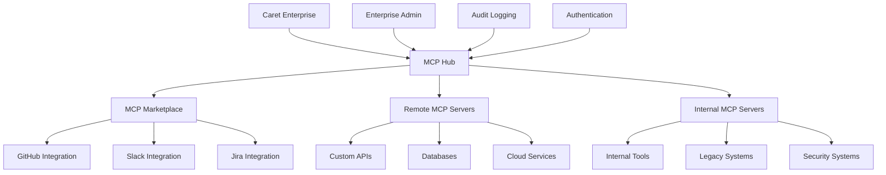

Model Context Protocol(MCP)은 AI 모델과 외부 데이터/도구/서비스 간 **표준화된 통신**을 제공합니다. 엔터프라이즈 MCP 통합은 조직 시스템과 Caret를 안전하게 연결하면서 거버넌스와 컴플라이언스를 유지합니다.

## 엔터프라이즈 MCP의 장점

<CardGroup cols={2}>
  <Card title="확장 가능한 아키텍처" icon="puzzle-piece">
    표준 MCP 서버로 다양한 도구/DB/API/서비스 연결
  </Card>
  
  <Card title="엔터프라이즈 보안" icon="shield-alt">
    인증/인가/감사 추적으로 안전한 통신
  </Card>
  
  <Card title="중앙 관리" icon="network-wired">
    버전 관리와 구성 관리로 MCP 서버 배포/운영
  </Card>
  
  <Card title="컴플라이언스 대응" icon="clipboard-check">
    로깅/모니터링/데이터 거버넌스를 내장
  </Card>
</CardGroup>

## MCP 아키텍처 개요



## 핵심 구성 요소

<CardGroup cols={2}>
  <Card title="MCP 마켓플레이스" icon="store" href="/enterprise-solutions/configuration/infrastructure-configuration/mcp/mcp-marketplace">
    사전 구성된 MCP 서버를 기업 환경에 맞게 배포
  </Card>
  
  <Card title="원격 MCP 서버" icon="server" href="/enterprise-solutions/configuration/infrastructure-configuration/mcp/remote-mcp-servers">
    커스텀 MCP 서버를 인프라 전반에 배포/관리
  </Card>
</CardGroup>

## 엔터프라이즈 구성

### 기본 MCP Hub 설정

```yaml
# mcp-hub-config.yaml
mcp:
  hub:
    enabled: true
    port: 8080
    authentication:
      method: "enterprise-sso"
      jwt_secret: "${MCP_JWT_SECRET}"
      
    # 서버 디스커버리
    discovery:
      methods: ["marketplace", "remote", "local"]
      marketplace_url: "https://mcp.company.com/marketplace"
      
    # 보안 설정
    security:
      enforce_tls: true
      allowed_origins: ["https://*.company.com"]
      rate_limiting:
        requests_per_minute: 1000
        burst_size: 100
        
    # 감사/컴플라이언스
    audit:
      enabled: true
      log_level: "INFO"
      destinations: ["file", "syslog", "datadog"]
      retention_days: 90
```

### 환경별 구성

<Tabs>
<Tab title="Development">
```yaml
# mcp-dev-config.yaml
mcp:
  environment: "development"
  
  servers:
    - name: "github-dev"
      type: "marketplace"
      package: "@cline/mcp-github"
      version: "latest"
      config:
        github_token: "${GITHUB_DEV_TOKEN}"
        org: "company-dev"
        
    - name: "local-db"
      type: "remote" 
      url: "http://localhost:3001"
      auth:
        type: "api-key"
        key: "${DEV_DB_API_KEY}"
        
  policies:
    allow_experimental: true
    auto_update: true
    rate_limits:
      relaxed: true
```
</Tab>

<Tab title="Production">
```yaml
# mcp-prod-config.yaml
mcp:
  environment: "production"
  
  servers:
    - name: "github-prod"
      type: "marketplace"
      package: "@cline/mcp-github"
      version: "1.2.3"  # 고정 버전
      config:
        github_token: "${GITHUB_PROD_TOKEN}"
        org: "company"
        
    - name: "crm-integration"
      type: "remote"
      url: "https://mcp-crm.internal.company.com"
      auth:
        type: "mtls"
        cert_path: "/certs/mcp-client.pem"
        key_path: "/certs/mcp-client-key.pem"
        
    - name: "security-scanner"
      type: "remote"
      url: "https://security-mcp.company.com"
      auth:
        type: "oauth2"
        client_id: "${SECURITY_CLIENT_ID}"
        client_secret: "${SECURITY_CLIENT_SECRET}"
        
  policies:
    allow_experimental: false
    auto_update: false
    strict_versioning: true
    
  monitoring:
    metrics: true
    health_checks: true
    alert_on_failure: true
```
</Tab>
</Tabs>

## 서버 관리

### 라이프사이클 관리

GitOps 방식으로 MCP 서버 배포를 관리할 수 있습니다.

```yaml
# mcp-server-manifest.yaml
apiVersion: mcp.caret.team/v1
kind: MCPServer
metadata:
  name: custom-api-server
  namespace: caret-enterprise
spec:
  image: company/custom-mcp-server:v1.0.0
  replicas: 3
  
  config:
    api_endpoint: "https://api.internal.company.com"
    timeout: 30s
    retry_attempts: 3
    
  auth:
    type: service-account
    service_account: mcp-custom-api
    
  resources:
    requests:
      memory: "256Mi"
      cpu: "100m"
    limits:
      memory: "512Mi" 
      cpu: "500m"
      
  monitoring:
    enabled: true
    metrics_port: 9090
    health_endpoint: "/health"
    
  security:
    network_policy: strict
    pod_security_standard: restricted
```

### 구성 관리

Helm 차트로 배포 관리:

```yaml
# values-prod.yaml
mcp:
  hub:
    replicaCount: 3
    image:
      repository: caret/mcp-hub-enterprise
      tag: "1.5.2"
      
  servers:
    marketplace:
      enabled: true
      catalog_url: "https://enterprise-catalog.company.com"
      
    custom:
      - name: "salesforce"
        enabled: true
        image: "company/mcp-salesforce:1.0.0"
        config:
          instance_url: "https://company.my.salesforce.com"
          
      - name: "jira"
        enabled: true
        image: "company/mcp-jira:2.1.0"
        config:
          base_url: "https://company.atlassian.net"
          
  ingress:
    enabled: true
    className: nginx
    annotations:
      cert-manager.io/cluster-issuer: "letsencrypt-prod"
    hosts:
      - host: mcp.company.com
        paths:
          - path: /
            pathType: Prefix
    tls:
      - secretName: mcp-tls
        hosts:
          - mcp.company.com
```

## 보안 & 거버넌스

### 인증/인가

```yaml
# mcp-auth-config.yaml
authentication:
  providers:
    - name: "enterprise-sso"
      type: "oidc"
      issuer: "https://sso.company.com"
      client_id: "${SSO_CLIENT_ID}"
      client_secret: "${SSO_CLIENT_SECRET}"
      
    - name: "service-accounts"
      type: "jwt"
      signing_key: "${SERVICE_ACCOUNT_KEY}"
      
authorization:
  policies:
    - name: "developers"
      subjects: ["group:developers"]
      resources: ["mcp:servers:read", "mcp:servers:execute"]
      
    - name: "admins"
      subjects: ["group:mcp-admins"]
      resources: ["mcp:*"]
      
    - name: "security-team"
      subjects: ["group:security"]
      resources: ["mcp:audit:*", "mcp:servers:security-*"]
      
  rbac:
    enabled: true
    default_role: "viewer"
```

### 네트워크 보안

```yaml
# mcp-network-policy.yaml
apiVersion: networking.k8s.io/v1
kind: NetworkPolicy
metadata:
  name: mcp-server-policy
  namespace: caret-enterprise
spec:
  podSelector:
    matchLabels:
      app: mcp-server
  policyTypes:
    - Ingress
    - Egress
    
  ingress:
    - from:
        - namespaceSelector:
            matchLabels:
              name: caret-enterprise
        - podSelector:
            matchLabels:
              app: caret-core
      ports:
        - protocol: TCP
          port: 8080
          
  egress:
    # DNS 허용
    - to: []
      ports:
        - protocol: UDP
          port: 53
    # HTTPS 허용
    - to: []
      ports:
        - protocol: TCP
          port: 443
```

## 모니터링 & 관측성

### 메트릭 수집

```yaml
# mcp-monitoring.yaml
monitoring:
  metrics:
    enabled: true
    interval: 30s
    
    collectors:
      - name: "server-health"
        metrics:
          - mcp_server_status
          - mcp_server_response_time
          - mcp_server_error_rate
          
      - name: "hub-performance"
        metrics:
          - mcp_hub_requests_total
          - mcp_hub_request_duration
          - mcp_hub_active_connections
          
      - name: "resource-usage"
        metrics:
          - mcp_memory_usage
          - mcp_cpu_usage
          - mcp_network_io
          
  alerts:
    - name: "server-down"
      condition: "mcp_server_status == 0"
      severity: "critical"
      notification_channels: ["pagerduty", "slack"]
      
    - name: "high-error-rate"
      condition: "mcp_server_error_rate > 0.05"
      severity: "warning"
      notification_channels: ["slack"]
      
    - name: "performance-degradation"
      condition: "mcp_server_response_time > 5s"
      severity: "warning"
      notification_channels: ["email"]
```

### 감사 로깅

```json
{
  "timestamp": "2024-01-15T10:30:00Z",
  "event_type": "mcp_server_call",
  "user_id": "john.doe@company.com",
  "session_id": "sess_abc123",
  "server_name": "github-prod",
  "method": "github.create_issue",
  "request": {
    "repository": "company/project",
    "title": "Bug fix required",
    "sensitive_data_detected": false
  },
  "response": {
    "status": "success",
    "issue_id": "12345",
    "duration_ms": 234
  },
  "compliance": {
    "data_classification": "internal",
    "retention_required": true,
    "pii_detected": false
  }
}
```

## 커스텀 MCP 서버 개발

### 개발 프레임워크

```typescript
// custom-mcp-server.ts
import { MCPServer, Tool, Resource } from '@cline/mcp-enterprise-sdk';

class CustomAPIServer extends MCPServer {
  constructor() {
    super({
      name: 'custom-api-server',
      version: '1.0.0',
      description: 'Custom API integration server'
    });
    
    this.addTool(new DatabaseQueryTool());
    this.addResource(new UserDataResource());
  }
}

class DatabaseQueryTool implements Tool {
  name = 'query_database';
  description = 'Query the company database';
  
  async execute(params: any) {
    const result = await this.database.query(params.sql);
    
    // 감사 로그 기록
    await this.auditLog({
      action: 'database_query',
      query: params.sql,
      user: params.user_id,
      results_count: result.length
    });
    
    return result;
  }
  
  async validate(params: any): Promise<boolean> {
    return params.sql && !this.containsMaliciousSQL(params.sql);
  }
}
```

### 배포 파이프라인

```yaml
# .github/workflows/deploy-mcp-server.yml
name: Deploy MCP Server
on:
  push:
    branches: [main]
    paths: ['mcp-servers/**']
    
jobs:
  deploy:
    runs-on: ubuntu-latest
    steps:
      - uses: actions/checkout@v3
      
      - name: Build MCP Server
        run: |
          docker build -t company/mcp-server:${{ github.sha }} .
          docker push company/mcp-server:${{ github.sha }}
          
      - name: Deploy to Staging
        run: |
          helm upgrade mcp-server-staging ./helm-chart \
            --set image.tag=${{ github.sha }} \
            --namespace mcp-staging
            
      - name: Run Integration Tests
        run: |
          kubectl wait --for=condition=ready pod -l app=mcp-server -n mcp-staging
          npm run test:integration
          
      - name: Deploy to Production
        if: success()
        run: |
          helm upgrade mcp-server-prod ./helm-chart \
            --set image.tag=${{ github.sha }} \
            --namespace mcp-prod
```

## 모범 사례

### 보안
1. **인증**: 모든 MCP 서버에 인증 적용
2. **암호화**: TLS 사용
3. **검증**: 입력 검증/출력 정제
4. **최소 권한**: 필요한 권한만 부여
5. **감사**: 모든 호출 기록

### 성능
1. **캐싱** 적용
2. **연결 풀** 재사용
3. **비동기 처리**
4. **리소스 제한** 설정
5. **로드 밸런싱**

### 안정성
1. **헬스 체크** 구현
2. **서킷 브레이커** 적용
3. **재시도**(지수 백오프)
4. **그레이스풀 디그레이드**
5. **모니터링/알림**

## 프로덕션 체크리스트

- [ ] 보안 리뷰 완료
- [ ] 인증/인가 설정 완료
- [ ] 네트워크 정책 적용
- [ ] 모니터링/알림 구성
- [ ] 감사 로깅 활성화
- [ ] 리소스 제한 설정
- [ ] 헬스 체크 구현
- [ ] 통합 테스트 통과
- [ ] 재해 복구 계획 문서화
- [ ] 컴플라이언스 요구 사항 검증

## 시작하기

1. [MCP 마켓플레이스](/enterprise-solutions/configuration/infrastructure-configuration/mcp/mcp-marketplace)
2. [원격 MCP 서버](/enterprise-solutions/configuration/infrastructure-configuration/mcp/remote-mcp-servers)
3. [MCP 개발 가이드](/mcp/mcp-overview)
