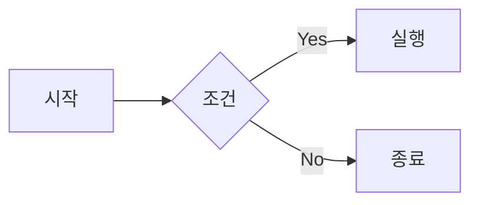

# 마크다운 렌더링

<BrandName /> AI 응답에서 GitHub Flavored Markdown(GFM)을 완벽하게 지원합니다. 테이블, 취소선, 코드 블록 등이 깔끔하게 렌더링되어 정보를 더 쉽게 파악할 수 있습니다.

## 지원 기능

### GFM 테이블

AI가 비교표, 옵션 목록 등을 테이블 형태로 응답할 때 구조화된 형태로 표시됩니다.

```markdown
| 기능 | Cline | Careti |
|------|-------|--------|
| GFM 테이블 | ❌ | ✅ |
| 취소선 | ❌ | ✅ |
| Mermaid | ✅ | ✅ |
```

**렌더링 결과:**

| 기능 | Cline | Careti |
|------|-------|--------|
| GFM 테이블 | ❌ | ✅ |
| 취소선 | ❌ | ✅ |
| Mermaid | ✅ | ✅ |

### 테이블 정렬

테이블 열의 정렬을 지정할 수 있습니다:

- `:---` - 왼쪽 정렬
- `:---:` - 가운데 정렬
- `---:` - 오른쪽 정렬

```markdown
| 왼쪽 | 가운데 | 오른쪽 |
|:-----|:------:|-------:|
| L | C | R |
```

### 취소선

`~~텍스트~~` 형식으로 취소선을 표시할 수 있습니다.

```markdown
~~이 텍스트는 취소되었습니다~~
```

**렌더링 결과:** ~~이 텍스트는 취소되었습니다~~

### Mermaid 다이어그램

플로우차트, 시퀀스 다이어그램 등을 시각적으로 렌더링합니다.

````markdown

````

### 코드 하이라이팅

다양한 프로그래밍 언어의 구문 강조를 지원합니다.

````markdown
```typescript
function greet(name: string): string {
  return `Hello, ${name}!`;
}
```
````

## Cline과의 차이점

<BrandName />은 원본 Cline에서 지원하지 않는 GFM 확장 기능을 추가로 지원합니다:

| 기능 | Cline | <BrandName /> |
|------|-------|---------------|
| 기본 마크다운 | ✅ | ✅ |
| GFM 테이블 | ❌ raw 텍스트 | ✅ 테이블 렌더링 |
| 테이블 정렬 | ❌ | ✅ |
| 취소선 | ❌ raw 텍스트 | ✅ 취소선 렌더링 |
| Mermaid | ✅ | ✅ |
| 코드 하이라이팅 | ✅ | ✅ |

## 활용 예시

### API 비교

AI에게 "REST API와 GraphQL을 비교해줘"라고 요청하면, 깔끔한 테이블 형태로 답변을 받을 수 있습니다.

### 변경 이력

`~~이전 코드~~` → `새로운 코드` 형태로 코드 변경사항을 명확하게 표시합니다.

### 아키텍처 설명

Mermaid 다이어그램으로 시스템 아키텍처, 데이터 흐름 등을 시각화합니다.

## 기술 정보

이 기능은 `remark-gfm` 플러그인을 통해 구현되었습니다. `react-remark`와의 버전 호환성을 위해 `remark-gfm@1.0.0`을 사용합니다.
