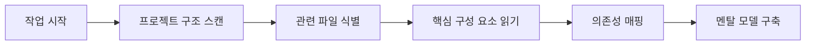

<Info>
**빠른 참조**

- **컨텍스트** = Caret가 프로젝트에 대해 알고 있는 모든 정보
- **컨텍스트 창** = 모델이 한 번에 처리할 수 있는 최대 정보량
- **토큰** = 텍스트 측정 단위(영어 단어의 약 3/4)
- **자동 관리** = 포커스 체인과 자동 압축이 컨텍스트를 자동 정리
</Info>

## 컨텍스트 관리란?

컨텍스트 관리는 대화 동안 Caret가 프로젝트를 이해하는 방식입니다. 코드, 결정 사항, 요구 사항, 진행 상황이 공유되는 공간으로 생각하면 쉽습니다.

<Frame caption="컨텍스트는 Caret가 프로젝트를 이해하는 공유 작업 공간입니다">
	
</Frame>

### 컨텍스트의 3가지 층

1. **즉시 컨텍스트** - 현재 대화와 활성 파일
2. **프로젝트 컨텍스트** - 코드베이스 구조와 패턴
3. **지속 컨텍스트** - Caret 규칙, 문서, 팀 지식 저장소

## 컨텍스트 창 이해하기

모든 AI 모델에는 한 번에 처리할 수 있는 **컨텍스트 창**이 있습니다. 토큰으로 측정되며 모델마다 크기가 다릅니다.

### 모델별 토큰 한도

| 모델 | 컨텍스트 창 | 권장 사용량* | 추천 용도 |
|-------|---------------|-----------------|----------|
| **Claude Sonnet 4.5** | 1,000,000 tokens | 750,000 tokens | 대규모 코드베이스, 복잡한 작업 |
| **GPT-5** | 400,000 tokens | 300,000 tokens | 리팩터링, 일반 개발 |
| **Gemini 2.5 Pro** | 1,000,000+ tokens | 750,000 tokens | 문서 분석, 초대형 컨텍스트 |
| **DeepSeek V3** | 128,000 tokens | 100,000 tokens | 가성비 중심 작업 |
| **Qwen3 Coder** | 256,000 tokens | 200,000 tokens | 코딩 특화 업무 |

*권장 사용량은 최대치의 약 75~80%입니다. 이 구간에서 성능이 안정적으로 유지됩니다.

<Tip>
**간단한 토큰 계산**
- 1 토큰 ≈ 영어 단어의 3/4
- 100 토큰 ≈ 75 단어 ≈ 코드 3~5줄
- 10,000 토큰 ≈ 7,500 단어 ≈ 텍스트 15쪽 내외
- 일반 소스 파일: 500~2,000 토큰
</Tip>

## Caret가 컨텍스트를 구축하는 방식

Caret는 단순히 정보를 기다리지 않습니다. 작업을 시작하면 필요한 맥락을 능동적으로 수집하고, 사용자 입력을 받아 우선순위를 조정합니다.

### 1. 자동 컨텍스트 수집

작업을 시작하면 Caret가 자동으로 수행합니다.

**자동으로 수집하는 정보:**
- 프로젝트 구조와 파일 구성
- import 관계와 의존성
- 코드 패턴과 컨벤션
- 설정 파일과 환경 구성
- 최근 변경 사항 및 git 기록(@git 사용 시)

### 2. 사용자 주도 컨텍스트

자동 수집과 함께, 사용자가 제공하는 맥락이 정확도를 크게 높입니다.

다음 방식으로 컨텍스트를 강화할 수 있습니다.
- **@ 멘션**으로 파일/폴더/URL 지정
- **요구 사항**을 자연어로 설명
- **스크린샷** 공유로 UI 맥락 제공
- **문서/규칙** 추가(Caret 규칙, 문서화 체계)
- **질문에 답변**해 불확실성 제거

### 3. 동적 컨텍스트 조정

대화 진행 중에도 Caret는 중요도를 재평가합니다. 요청의 복잡도, 현재 작업 상태, 오류 메시지, 이전 결정 등을 고려해 무엇을 유지하고 무엇을 줄일지 결정합니다.

## 컨텍스트 창 진행률 표시줄

실시간으로 컨텍스트 사용량을 확인할 수 있습니다.

<Frame caption="컨텍스트 창 진행률 표시줄은 입력/출력 토큰 사용량을 보여줍니다">
	
</Frame>

### 표시기 의미

- ⬆️ **입력 토큰**: 모델에 전달되는 정보(메시지 + 컨텍스트)
- ⬇️ **출력 토큰**: 모델 응답과 생성된 코드
- ➡️ **캐시 토큰**: 재사용되는 토큰(비용/지연 감소)
- **진행률 바**: 총 컨텍스트 대비 현재 사용량
- **퍼센트**: 전체 용량 대비 사용 비율

## 자동 컨텍스트 관리 기능

Caret는 컨텍스트를 자동으로 관리해 작업 흐름을 유지합니다.

### 포커스 체인 (기본 ON)

작업 시작 시 자동으로 할 일 목록을 생성해 핵심 컨텍스트를 유지합니다. Auto Compact가 실행되어도 중요한 단계가 남아 있어 작업을 이어가기 쉽습니다.

[자세히 보기 →](/ko/features/focus-chain)

### 자동 압축 (항상 ON)

컨텍스트가 약 80%에 도달하면 자동으로 요약을 생성해 공간을 확보합니다. 요약은 결정 사항과 코드 변경 사항을 보존하며, 작업 흐름을 끊지 않습니다.

[자세히 보기 →](/ko/features/auto-compact)

### 컨텍스트 절단 시스템

자동 압축 이전에 한계에 접근하면, Caret의 컨텍스트 매니저가 오래된 기록을 순차적으로 정리합니다.

우선 유지되는 것:
- 최초 작업 설명
- 최근 도구 실행 결과
- 현재 코드 상태와 활성 오류
- 사용자-Assistant 메시지의 논리 흐름

우선 제거되는 것:
- 중복된 이전 대화
- 더 이상 필요 없는 도구 출력
- 중간 디버깅 단계
- 목적을 달성한 장문의 설명

이 과정은 자동으로 진행되며, 작업을 중단하지 않습니다.

## 베스트 프랙티스

- **구체적으로 요청하기** - 명확한 목표가 정확도를 높입니다
- **@ 멘션 전략적으로 사용** - 폴더 전체보다 파일 단위가 좋습니다
- **진행률 바 확인** - 노란색/빨간색이면 `/smol`이나 `/newtask` 고려
- **자동 관리 신뢰하기** - 포커스 체인과 자동 압축이 흐름을 유지
- **지속 컨텍스트 사용** - 팀 규칙/문서로 지식 축적

## 다음 단계

<CardGroup cols={2}>
	<Card title="포커스 체인" icon="link" href="/ko/features/focus-chain">
		작업 연속성을 유지하는 방법
	</Card>
	<Card title="자동 압축" icon="compress" href="/ko/features/auto-compact">
		대화 요약과 컨텍스트 보존
	</Card>
	<Card title="Caret 컨텍스트 시스템" icon="brain" href="/prompting/caret-memory-bank">
		AGENTS.md + .agents/context 기반의 지식 체계
	</Card>
	<Card title="Caret 규칙" icon="gavel" href="/ko/features/caret-rules">
		프로젝트별 규칙과 컨벤션 정의
	</Card>
</CardGroup>
