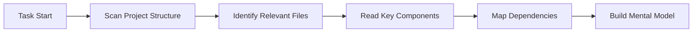

<Info>
**Быстрая справка**

- **Контекст** = Вся информация, которую Caret знает о вашем проекте
- **Контекстное окно** = Максимальная информация, которую Caret может обработать за раз (зависит от модели)
- **Токен** = Единица измерения текста (~3/4 английского слова)
- **Автоматическое управление** = Caret автоматически управляет контекстом через Focus Chain и Auto Compact
</Info>

## Что такое управление контекстом?

Управление контекстом — это то, как Caret поддерживает понимание вашего проекта во время разговора. Думайте об этом как о совместной памяти между вами и Caret — содержащей код, решения, требования и прогресс.

<Frame caption="Контекст похож на совместное рабочее пространство, в котором Caret развивает понимание вашего проекта">
	
</Frame>

### Три уровня контекста

1. **Непосредственный контекст** - Текущий разговор и активные файлы
2. **Контекст проекта** - Ваша кодовая база, структура и паттерны
3. **Постоянный контекст** - AGENTS.md, .agents/context, caret-docs и work-logs

## Понимание контекстных окон

Каждая модель AI имеет **контекстное окно** — максимальное количество информации, которое она может обработать в одном разговоре. Это измеряется в токенах:

### Ограничения токенов по моделям

| Модель | Контекстное окно | Эффективный лимит* | Лучше всего подходит для |
|--------|------------------|-------------------|-------------------------|
| **Claude 3.5 Sonnet** | 200 000 токенов | 150 000 токенов | Сложные задачи, большие кодовые базы |
| **Claude 3.5 Haiku** | 200 000 токенов | 150 000 токенов | Более быстрые ответы, более простые задачи |
| **GPT-4o** | 128 000 токенов | 100 000 токенов | Разработка общего назначения |
| **Gemini 2.0 Flash** | 1 000 000+ токенов | 400 000 токенов | Очень большие контексты |
| **DeepSeek v3** | 64 000 токенов | 50 000 токенов | Экономичная разработка |
| **Qwen 2.5 Coder** | 128 000 токенов | 100 000 токенов | Специализированные задачи кодирования |

*Эффективный лимит составляет ~75-80% от максимума для оптимальной производительности

<Tip>
**Математика токенов упрощена**
- 1 токен ≈ 3/4 английского слова
- 100 токенов ≈ 75 слов ≈ 3-5 строк кода
- 10 000 токенов ≈ 7 500 слов ≈ ~15 страниц текста
- Типичный исходный файл: 500-2000 токенов
</Tip>

## Как Caret создаёт контекст

Создание эффективного контекста — вот что делает Caret действительно полезным. Когда вы начинаете задачу, Caret не просто пассивно ждёт информацию — он активно собирает контекст о вашем проекте, задаёт уточняющие вопросы при необходимости и адаптируется к тому, что происходит в реальном времени. Эта комбинация автоматического обнаружения, руководства пользователя и динамической адаптации гарантирует, что Caret всегда имеет правильную информацию для эффективного решения ваших проблем.

### 1. Автоматический сбор контекста

Когда вы начинаете задачу, Caret активно:

**Что Caret автоматически обнаруживает:**
- Структура проекта и организация файлов
- Отношения импорта и зависимости
- Паттерны кода и соглашения
- Файлы конфигурации и параметры
- Недавние изменения и историю git (при использовании @git)

### 2. Контекст, управляемый пользователем

Хотя автоматическое обнаружение выполняет большую часть работы, вы контролируете, на что Caret сосредоточивается. Чем более специфичный и релевантный контекст вы предоставляете, тем лучше Caret может понять ваши потребности и предоставить точные решения.

Вы улучшаете контекст путём:
- **@ Упоминания** файлов, папок или URL-адресов
- **Предоставления требований** на естественном языке
- **Совместного использования скриншотов** для контекста UI
- **Добавления документации** через AGENTS.md + .agents/context + caret-docs
- **Ответов на вопросы** когда Caret нуждается в уточнении

### 3. Динамическая адаптация контекста

Caret динамически адаптирует контекст на протяжении вашего разговора. Она рассматривает сложность вашего запроса, доступное пространство окна контекста, текущий прогресс задачи, сообщения об ошибках и обратную связь, а также предыдущие решения, принятые во время разговора, чтобы определить, какая информация имеет значение на каждом шаге.

## Полоса прогресса контекстного окна

Контролируйте использование контекста в реальном времени:

<Frame caption="Полоса окна контекста показывает использование токенов ввода/вывода">
	
</Frame>

### Понимание индикаторов

- ⬆️ **Входные токены**: Информация, отправляемая модели (ваши сообщения + контекст)
- ⬇️ **Выходные токены**: Ответы модели и сгенерированный код
- ➡️ **Токены кэша**: Ранее обработанные токены, которые повторно используются (снижает затраты и улучшает скорость)
- **Полоса прогресса**: Визуальное представление использования
- **Процент**: Текущее использование от общей ёмкости

## Функции автоматического управления контекстом

Caret включает интеллектуальные системы, которые управляют контекстом за вас:

### Focus Chain (По умолчанию: ВКЛ)

Focus Chain поддерживает непрерывность задачи через автоматические списки задач. Когда вы начинаете задачу, Caret генерирует действенные шаги и обновляет их по мере выполнения работы. Это сохраняет критический контекст видимым даже после запуска Auto Compact, позволяя вам отслеживать прогресс без прокрутки по всему разговору.

[Узнайте больше →](/ru/features/focus-chain)

### Auto Compact (Всегда ВКЛ)

Когда использование контекста достигает примерно 80%, Auto Compact автоматически создаёт комплексный краткий обзор разговора. Это сохраняет все решения и изменения кода, освобождая место для продолжения работы. Вы увидите сообщение, когда это произойдёт. Задача продолжается бесперебойно — вам не нужно ничего делать.

[Узнайте больше →](/ru/features/auto-compact)

### Система обрезки контекста

Если ваш разговор приближается к пределу контекстного окна модели перед запуском Auto Compact, менеджер контекста Caret автоматически обрезает более старые части разговора, чтобы предотвратить ошибки.

Система расставляет приоритеты в том, что имеет значение:
- Описание вашей исходной задачи остаётся
- Недавние выполнения инструментов и их результаты остаются неповреждёнными
- Текущее состояние кода и активные ошибки сохраняются
- Логический поток сообщений пользователя и помощника сохраняется

Что удаляется в первую очередь:
- Избыточная история разговоров с более ранней части задачи
- Завершённые результаты инструментов, которые больше не актуальны
- Промежуточные шаги отладки
- Подробные объяснения, которые выполнили свою задачу

Это происходит автоматически. Вы будете продолжать работать без прерываний, и Caret сохраняет достаточно контекста, чтобы продолжить эффективное решение вашей проблемы.

## Лучшие практики

- **Будьте конкретны** - Чёткие объективы помогают Caret понять ваши потребности
- **Стратегически используйте @ упоминания** - Ссылайтесь на конкретные файлы, а не на целые папки
- **Контролируйте полосу прогресса** - Жёлтый/красный означает рассмотрение использования `/smol` или `/newtask`
- **Доверяйте автоматическому управлению** - Focus Chain и Auto Compact автоматически справляются со сложностью
- **Используйте систему контекста Caret** - Держите AGENTS.md + .agents/context + caret-docs синхронизированными

## Следующие шаги

<CardGroup cols={2}>
	<Card title="Focus Chain" icon="link" href="/ru/features/focus-chain">
		Узнайте, как Focus Chain поддерживает непрерывность задачи
	</Card>
	<Card title="Auto Compact" icon="compress" href="/ru/features/auto-compact">
		Поймите автоматическое сжатие разговора
	</Card>
	<Card title="Система контекста Caret" icon="brain" href="/ru/prompting/caret-memory-bank">
		Замените Memory Bank на AGENTS.md + .agents/context
	</Card>
	<Card title="Правила Caret" icon="gavel" href="/ru/features/caret-rules">
		Определите соглашения, специфичные для проекта
	</Card>
</CardGroup>
