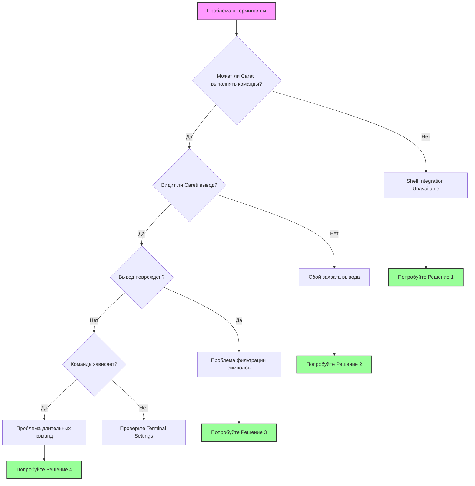

Это руководство поможет вам решить проблемы с интеграцией терминала в Careti. Интеграция терминала крайне важна для того, чтобы Careti мог выполнять команды и читать их вывод, что позволяет ему понимать ошибки, результаты тестов и ответы команд.

<Tip>
	Если вы столкнулись с проблемами терминала, попробуйте переключиться на более простую оболочку, например `bash`, в настройках Careti, в разделе "Terminal Settings".

    Это решает большинство проблем с интеграцией терминала.

</Tip>

## Схема быстрой диагностики

Следуйте этой схеме, чтобы быстро определить вашу проблему:



## Распространенные проблемы и быстрые решения

### 1. Shell Integration Unavailable

**Симптомы:**

-   Сообщение: "Shell Integration Unavailable"
-   Команды выполняются, но Careti не может прочитать вывод
-   Терминал работает нормально вручную, но не через Careti

**Быстрые решения:**

#### macOS

-   **Переключитесь на bash**

    1. Перейдите в Careti Settings
    2. Кликните левой кнопкой мыши на вкладку **"Terminal Settings"**
    3. Найдите **"Default Terminal Profile"** и выберите **"bash"** из выпадающего меню

-   **Временно отключите Oh-My-Zsh**:

    1. Если вы используете zsh, введите `mv ~/.zshrc ~/.zshrc.backup` в терминале
    2. Перезапустите VS Code

-   **Настройте окружение**:
    1.a Для пользователей Zsh: используйте одну из следующих команд Zsh для редактирования профиля оболочки:

          - `nano ~/.zshrc`
          - `vim ~/.zshrc`
          - `code ~/.zshrc`

    1.b Для пользователей Bash:

          - nano ~/.bash_profile

    2. Добавьте следующее в конфигурацию вашей оболочки: `export TERM=xterm-256color`
    3. Сохраните конфигурацию

#### Windows

-   **Используйте PowerShell 7**

    1. Установите его из Microsoft Store
    2. Перейдите в Careti Settings
    3. Кликните левой кнопкой мыши на вкладку **"Terminal Settings"**
    4. Найдите **"Default Terminal Profile"** и выберите **"PowerShell 7"** из выпадающего меню

-   **Отключите Windows ConPTY**

    1. Перейдите в настройки VS Code
    2. Введите "Integrated: Windows Enable Conpty" в строке поиска настроек
    3. Снимите галочку с этого параметра

-   **Попробуйте Command Prompt**
    1. Перейдите в Careti Settings
    2. Кликните левой кнопкой мыши на вкладку **"Terminal Settings"**
    3. Найдите **"Default Terminal Profile"** и выберите **"Command Prompt"** из выпадающего меню

#### Linux

-   **Используйте bash**

    1. Перейдите в Careti Settings
    2. Кликните левой кнопкой мыши на вкладку **"Terminal Settings"**
    3. Найдите **"Default Terminal Profile"** и выберите **"bash"** из выпадающего меню

-   **Проверьте разрешения**

    1. Убедитесь, что у VS Code есть разрешения на доступ к терминалу

-   **Отключите кастомные prompt (приглашения)**
    1. Закомментируйте настройки оформления prompt в `.bashrc`

### 2. Вывод команд не виден

**Симптомы:**

-   Careti сообщает в чате: "[Command is running but producing no output]"
-   Команды завершаются, но Careti не видит результаты
-   Команды работают иногда, но не всегда

**Решения:**

-   **Увеличьте Shell Integration Timeout**

    1. В Careti кликните левой кнопкой мыши на кнопку **Settings** в правом верхнем углу окна чата
    2. В окне **Settings** выберите вкладку **"Terminal Settings"** в левой колонке
    3. Найдите "Shell integration timeout (seconds)" и введите **"10"** в текстовое поле

-   **Отключите Terminal Reuse**

    1. В Careti кликните левой кнопкой мыши на кнопку **Settings** в правом верхнем углу окна чата
    2. В окне **Settings** выберите вкладку **"Terminal Settings"** в левой колонке
    3. Найдите **"Enable aggressive terminal reuse"** и **снимите галочку** с этого параметра

-   **Проверьте конфликтующие расширения**
    1. Отключите другие расширения VS Code, связанные с терминалом

### 3. Проблемы с фильтрацией символов

**Симптомы:**

-   В выводе отсутствуют запятые (JSON кажется поврежденным)
-   Специальные символы удаляются из вывода терминала
-   Ошибки синтаксиса, которые не появляются при ручном запуске

**Решение:**
Это известная ошибка в обработке вывода. Обходные пути:

-   Рекомендуйте AI использовать вывод в файл
    1. Сообщите Careti в чате или в правилах Careti, чтобы он использовал `command > output.txt` перед чтением файла/файлов

<Tip>
	Это семейство проблем решено лишь частично в последних версиях Careti, поэтому если вы все еще сталкиваетесь с этим, создайте issue на GitHub, если проблема сохраняется.
</Tip>

### 4. Длительные команды и индикаторы прогресса

**Симптомы:**

-   Сборки Docker никогда не завершаются в Careti
-   Индикаторы прогресса (progress bars) потребляют тысячи токенов
-   Кнопка Careti "Proceed while running" не работает должным образом в чате

<Tip>
	Это семейство проблем было решено в последних версиях Careti, но если вы все еще сталкиваетесь с какими-либо трудностями, создайте issue на GitHub по этому поводу.
</Tip>

## Описание настроек терминала

Доступ к ним можно получить в Careti, нажав на иконку настроек и перейдя в раздел "Terminal Settings":

### Default Terminal Profile

-   **Что это делает**: Выбирает, какую оболочку Careti использует для команд
-   **Когда менять**: Если возникают проблемы с интеграцией Shell в вашей оболочке по умолчанию
-   **Рекомендуется**: - macOS: bash (если есть проблемы с zsh) - Windows: PowerShell 7 - Linux: bash

### Shell Integration Timeout

-   **Что это делает**: Как долго Careti ждет готовности терминала
-   **По умолчанию**: 4 секунды
-   **Когда увеличивать**:
    -   Медленный запуск оболочки (тяжелые .zshrc/.bashrc)
    -   Среды WSL
    -   SSH-соединения
-   **Рекомендуется**: - Начните с 10 секунд, если есть проблемы

### Enable Aggressive Terminal Reuse

-   **Что это делает**: Повторно использует существующие терминалы, даже если они находятся не в той директории
-   **Когда отключать**:
    -   Команды выполняются в неправильной директории
    -   Проблемы с виртуальными окружениями
    -   Повреждение состояния терминала
-   **Компромисс**: - Отключение создает больше терминалов, но гарантирует чистое состояние

### Terminal Output Line Limit

-   **Что это делает**: Ограничивает количество строк, которые Careti считывает из вывода терминала
-   **По умолчанию**: 500 строк
-   **Когда изменять**:
    -   Увеличьте для подробных выводов сборки
    -   Уменьшите, если упираетесь в лимиты токенов
    -   Установите 100 для команд с индикаторами прогресса

## Решения для конкретных платформ

### Проблемы macOS

#### Конфликты Oh-My-Zsh

Oh-My-Zsh часто мешает интеграции Shell. Решения:

1. Создайте минимальный `.zshrc` для VS Code:
    ```bash
    # ~/.zshrc-vscode
    export TERM=xterm-256color
    export PAGER=cat
    # Minimal PATH and environment setup
    ```
2. Настройте VS Code на его использование:
    ```json
    {
    	"terminal.integrated.env.osx": {
    		"ZDOTDIR": "~/.zshrc-vscode"
    	}
    }
    ```

#### Проблемы macOS 15+

В последних версиях macOS действуют более строгие разрешения для терминала:

1. System Preferences → Privacy & Security → Developer Tools
2. Добавьте Visual Studio Code
3. Полностью перезапустите VS Code

### Проблемы Windows

Если вы используете Windows и все еще сталкиваетесь с проблемами интеграции Shell после выполнения предыдущих шагов, рекомендуется использовать Git Bash (или PowerShell).

### Git Bash

Git Bash — это эмулятор терминала, обеспечивающий работу в командной строке в стиле Unix на Windows. Чтобы использовать Git Bash, вам нужно:

1. Скачать и запустить установщик Git for Windows с [https://git-scm.com/downloads/win](https://git-scm.com/downloads/win)
2. Закрыть и снова открыть VS Code
3. Нажать `Ctrl + Shift + P`, чтобы открыть Command Palette
4. Ввести "Terminal: Select Default Profile" и выбрать этот пункт
5. Выбрать "Git Bash"

### PowerShell

Если вы все же хотите использовать PowerShell, убедитесь, что вы используете обновленную версию (как минимум v7+).
  - Проверьте текущую версию PowerShell, запустив: `$PSVersionTable.PSVersion`
  - Если ваша версия ниже 7, [обновите PowerShell](https://learn.microsoft.com/en-us/powershell/scripting/whats-new/migrating-from-windows-powershell-51-to-powershell-7?view=powershell-7.4#installing-powershell-7).

Вам также может потребоваться настроить политику выполнения (execution policy) PowerShell. По умолчанию PowerShell ограничивает выполнение скриптов в целях безопасности.

#### Понимание политик выполнения PowerShell

PowerShell использует политики выполнения, чтобы определить, какие скрипты могут запускаться в вашей системе. Вот наиболее распространенные политики:

- `Restricted`: Скрипты PowerShell запускать нельзя. Это настройка по умолчанию.
- `AllSigned`: Все скрипты, включая локальные, должны быть подписаны доверенным издателем.
- `RemoteSigned`: Скрипты, созданные локально, могут запускаться, но скрипты, загруженные из интернета, должны быть подписаны.
- `Unrestricted`: Ограничений нет. Любой скрипт может быть запущен, хотя перед запуском скриптов, загруженных из интернета, вы получите предупреждение.

Для разработки в VS Code обычно рекомендуется политика `RemoteSigned`. Она позволяет запускать локально созданные скрипты без ограничений, сохраняя при этом безопасность для загруженных скриптов. Чтобы узнать больше о политиках выполнения PowerShell и понять последствия их изменения для безопасности, посетите документацию Microsoft: [About Execution Policies](https://learn.microsoft.com/en-us/powershell/module/microsoft.powershell.core/about/about_execution_policies).

#### Шаги по изменению политики выполнения

1. Откройте PowerShell от имени администратора: Нажмите `Win + X` и выберите "Windows PowerShell (Administrator)" или "Windows Terminal (Administrator)".

2. Проверьте текущую политику выполнения, запустив эту команду:
     ```powershell
     Get-ExecutionPolicy
     ```
   - Если результат уже `RemoteSigned`, `Unrestricted` или `Bypass`, вам, скорее всего, не нужно менять политику. Эти настройки должны позволять интеграции Shell работать.
   - Если результат `Restricted` или `AllSigned`, вам может потребоваться изменить политику для включения интеграции Shell.

3. Измените политику выполнения, запустив следующую команду:
     ```powershell
     Set-ExecutionPolicy RemoteSigned -Scope CurrentUser
     ```
   - Это установит политику `RemoteSigned` только для текущего пользователя, что безопаснее, чем менять ее для всей системы.

4. Подтвердите изменение, введя `Y` и нажав Enter при появлении запроса.

5. Проверьте изменение политики, снова запустив `Get-ExecutionPolicy`, чтобы подтвердить новую настройку.

6. Перезапустите VS Code и снова попробуйте интеграцию Shell.


#### Интеграция WSL

При проблемах с WSL:

1. Используйте расширение WSL для VS Code
2. Откройте папку в WSL: `code .` из терминала WSL
3. Выберите "WSL Bash" в качестве профиля терминала в Careti

#### Проблемы с путями (Path)

Проблемы с путями в Windows:

1. Используйте прямые слеши в Careti: `C:/Users/...`
2. Заключайте пути с пробелами в кавычки: `"C:/Program Files/..."`
3. Избегайте использования `~` — используйте полные пути

### Проблемы Linux/SSH/Контейнеров

#### SSH-соединения

Для удаленной разработки:

1. Установите Careti на удаленной машине, а не локально
2. Используйте интегрированный терминал расширения SSH
3. Увеличьте таймаут до 15+ секунд

#### Контейнеры Docker

При разработке в контейнерах:

1. Установите Careti в контейнере
2. Используйте расширение Dev Containers
3. Убедитесь, что скрипты интеграции Shell доступны

## Исправления для конкретных оболочек

### Zsh

```bash
# Добавьте в ~/.zshrc
export TERM=xterm-256color
export PAGER=cat
# Disable fancy prompts for VSCode
if [[ "$TERM_PROGRAM" == "vscode" ]]; then
    PS1="%n@%m %1~ %# "
fi
```

### Bash

```bash
# Добавьте в ~/.bashrc
export TERM=xterm-256color
export PAGER=cat
# Simple prompt for VSCode
if [[ "$TERM_PROGRAM" == "vscode" ]]; then
    PS1='\u@\h:\w\$ '
fi
```

### Fish

```fish
# Добавьте в ~/.config/fish/config.fish
set -x TERM xterm-256color
set -x PAGER cat
# Disable fancy features in VSCode
if test "$TERM_PROGRAM" = "vscode"
    function fish_prompt
        echo (whoami)'@'(hostname)':'(pwd)'> '
    end
end
```

### PowerShell

```powershell
# Добавьте в $PROFILE
$env:PAGER = "cat"
# Disable progress bars
$ProgressPreference = 'SilentlyContinue'
```

## Расширенное устранение неполадок

### Режим отладки (Debug Mode)

Включите отладку терминала, чтобы увидеть, что происходит:

1. Откройте VS Code Command Palette (Cmd/Ctrl+Shift+P)
2. Запустите: "Developer: Set Log Level..."
3. Выберите "Trace"
4. Проверьте панель Output → "Careti" на наличие логов терминала

### Ручная проверка интеграции Shell

Проверьте, работает ли интеграция Shell вообще:

```bash
# В терминале VSCode
echo $TERM_PROGRAM  # Должно показать "vscode"
echo $VSCODE_SHELL_INTEGRATION  # Должно быть "1"
```

## FAQ

### Почему Careti создает так много терминалов?

Когда интеграция Shell не удается, Careti не может безопасно использовать терминалы повторно (в них могут выполняться длительные процессы). Включите интеграцию Shell или измените настройку повторного использования терминала.

### Могу ли я использовать кастомную оболочку (nushell, xonsh и т. д.)?

Careti официально поддерживает bash, zsh, fish и PowerShell. Кастомные оболочки могут работать, но это не гарантируется. Используйте bash в качестве резервного варианта.

### Почему одни команды работают, а другие нет?

Команды, использующие интерактивные функции (pagers, индикаторы прогресса, curses), часто дают сбой. Установите `PAGER=cat` и используйте неинтерактивные флаги.

### Как узнать, работает ли интеграция Shell?

При работающей интеграции вывод команд отображается в чате Careti. При неудачной интеграции отображается "Shell Integration Unavailable" или "[Command is running but producing no output]".

## Проблемы все еще сохраняются?

Если вы перепробовали всё:

1. **Соберите информацию для отладки**:

    ```bash
    echo "Shell: $SHELL"
    echo "Term: $TERM"
    echo "VSCode: $TERM_PROGRAM"
    which bash
    bash --version
    ```

2. **Сообщите о проблеме**:
    - Используйте `/reportbug` в GitHub issues Careti
    - Приложите информацию для отладки
    - Укажите, какие решения вы пробовали

<Tip>
	Помните: большинство проблем с терминалом решаются переключением на bash и увеличением таймаута. Начните с этого, прежде чем пробовать сложные решения.
</Tip>