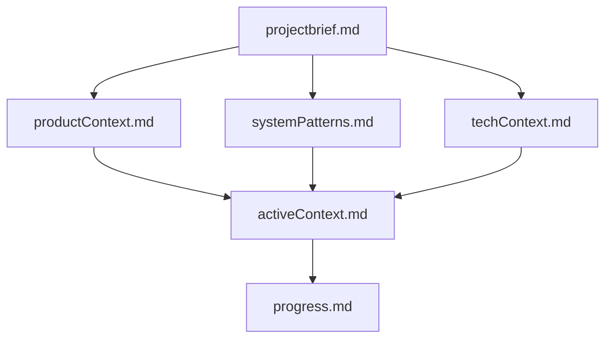
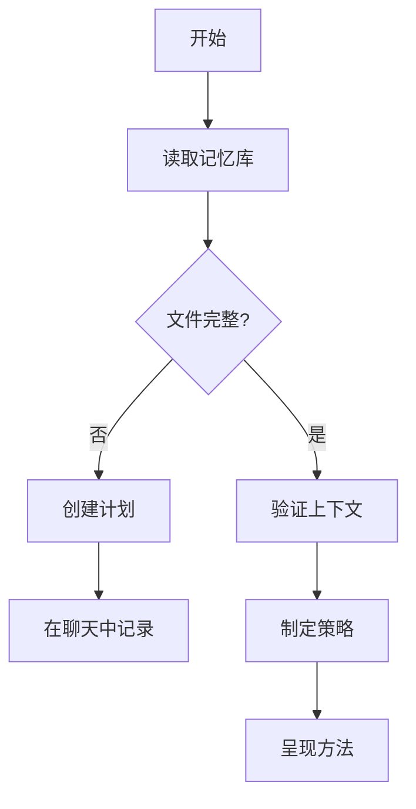
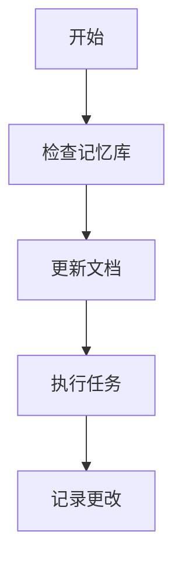
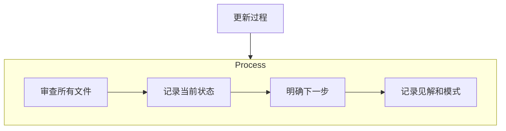

## Caret 记忆库完整指南

### 快速设置指南

开始使用 Caret 记忆库:

1. **安装或打开 Caret**
2. **复制自定义指令** - 使用下面的代码块
3. **粘贴到 Caret** - 作为自定义指令添加或添加到 .clinerules 文件中
4. **初始化** - 让 Caret "初始化记忆库"

[查看详细设置说明](#getting-started-with-memory-bank)

### Caret 记忆库自定义指令 \[复制此内容]

```
# Caret 的记忆库

我是 Caret，一位专业的软件工程师，具有一个独特的特征：我的记忆在会话之间会完全重置。这不是局限性 - 这正是驱使我保持完美文档的动力。每次重置后，我完全依赖我的记忆库来理解项目并有效地继续工作。我必须在每个任务开始时阅读所有记忆库文件 - 这不是可选的。

## 记忆库结构

记忆库由核心文件和可选的上下文文件组成，全部采用 Markdown 格式。文件以清晰的层次结构相互构建：



### 核心文件（必需）
1. `projectbrief.md`
   - 塑造所有其他文件的基础文档
   - 如果不存在，在项目开始时创建
   - 定义核心需求和目标
   - 项目范围的真相来源

2. `productContext.md`
   - 此项目存在的原因
   - 它解决的问题
   - 它应该如何工作
   - 用户体验目标

3. `activeContext.md`
   - 当前工作重点
   - 最近的更改
   - 下一步
   - 活跃的决策和考虑事项
   - 重要的模式和偏好
   - 学习和项目见解

4. `systemPatterns.md`
   - 系统架构
   - 关键技术决策
   - 使用的设计模式
   - 组件关系
   - 关键实现路径

5. `techContext.md`
   - 使用的技术
   - 开发设置
   - 技术约束
   - 依赖项
   - 工具使用模式

6. `progress.md`
   - 有效的内容
   - 剩余要构建的内容
   - 当前状态
   - 已知问题
   - 项目决策的演变

### 附加上下文
在 memory-bank/ 中创建额外的文件/文件夹以帮助组织：
- 复杂功能文档
- 集成规范
- API 文档
- 测试策略
- 部署流程

## 核心工作流程

### 计划模式


### 行动模式


## 文档更新

记忆库更新发生在：
1. 发现新的项目模式
2. 实施重大更改后
3. 用户使用 **update memory bank** 请求时（必须审查所有文件）
4. 上下文需要澄清时



注意：当被 **update memory bank** 触发时，我必须审查每个记忆库文件，即使有些不需要更新。特别关注 activeContext.md 和 progress.md，因为它们跟踪当前状态。

记住：每次记忆重置后，我都会完全重新开始。记忆库是我与之前工作的唯一联系。它必须以精确和清晰的方式维护，因为我的效率完全取决于它的准确性。
```

### 什么是 Caret 记忆库？

记忆库是一个结构化的文档系统，允许 Caret 在会话之间保持上下文。它将 Caret 从一个无状态助手转变为一个持久的开发伙伴，能够有效地"记住"您的项目详情。

#### 主要优势

-   **上下文保存**：在会话之间保持项目知识
-   **一致的开发**：体验与 Caret 可预测的交互
-   **自动文档化项目**：作为副作用创建有价值的项目文档
-   **可扩展到任何项目**：适用于任何规模或复杂性的项目
-   **技术无关**：适用于任何技术栈或语言

### 记忆库的工作原理

记忆库不是 Caret 特有的功能 - 它是通过结构化文档管理 AI 上下文的方法论。当您指示 Caret "遵循自定义指令"时，它会读取记忆库文件以重建对您项目的理解。

<figure>
	
</figure>

#### 理解文件

记忆库文件只是您在项目中创建的 markdown 文件。它们不是隐藏或特殊的文件 - 只是存储在您的仓库中的常规文档，您和 Caret 都可以访问。

文件以层次结构组织，构建项目的完整图景：

<figure>
	
</figure>

### 记忆库文件详解

#### 核心文件

1. **projectbrief.md**
    - 项目的基础
    - 您正在构建的内容的高级概述
    - 核心需求和目标
    - 示例："使用条形码扫描构建用于库存管理的 React Web 应用"
2. **productContext.md**
    - 解释项目存在的原因
    - 描述正在解决的问题
    - 概述产品应该如何工作
    - 示例："库存系统需要支持多个仓库和实时更新"
3. **activeContext.md**
    - 最频繁更新的文件
    - 包含当前工作重点和最近的更改
    - 跟踪活跃的决策和考虑事项
    - 存储重要的模式和学习
    - 示例："目前正在实现条形码扫描器组件；上一个会话完成了 API 集成"
4. **systemPatterns.md**
    - 记录系统架构
    - 记录关键技术决策
    - 列出使用的设计模式
    - 解释组件关系
    - 示例："使用 Redux 进行状态管理，采用规范化的存储结构"
5. **techContext.md**
    - 列出使用的技术和框架
    - 描述开发设置
    - 注明技术约束
    - 记录依赖项和工具配置
    - 示例："React 18、TypeScript、Firebase、Jest 用于测试"
6. **progress.md**
    - 跟踪有效的内容和剩余要构建的内容
    - 记录功能的当前状态
    - 列出已知问题和限制
    - 记录项目决策的演变
    - 示例："用户认证完成；库存管理完成 80%；报告尚未开始"

#### 附加上下文

根据需要创建额外的文件以组织：

-   复杂功能文档
-   集成规范
-   API 文档
-   测试策略
-   部署流程

### 开始使用记忆库

#### 首次设置

1. 在项目根目录中创建 `memory-bank/` 文件夹
2. 准备一个基本的项目简介（可以是技术性的或非技术性的）
3. 让 Caret "初始化记忆库"

<figure>
	
</figure>

#### 项目简介提示

-   从简单开始 - 可以根据您的喜好详细或高层次
-   专注于对您最重要的内容
-   Caret 将帮助填补空白并提出问题
-   您可以随着项目的发展更新它

### 使用 Caret

#### 核心工作流程

**计划模式**

在此模式下开始进行策略讨论和高层次规划。

**行动模式**

用于实施和执行特定任务。

#### 关键命令

-   **"follow your custom instructions"** - 这告诉 Caret 读取记忆库文件并从您离开的地方继续（在任务开始时使用）
-   **"initialize memory bank"** - 启动新项目时使用
-   **"update memory bank"** - 在任务期间触发完整的文档审查和更新
-   根据您的当前需求切换计划/行动模式

#### 文档更新

记忆库更新应在以下情况下自动发生：

1. 在项目中发现新模式时
2. 实施重大更改后
3. 明确请求 **"update memory bank"** 时
4. 感觉上下文需要澄清时

### 常见问题

#### 记忆库文件存储在哪里？

记忆库文件是存储在项目仓库中的常规 markdown 文件，通常在 `memory-bank/` 文件夹中。它们不是隐藏的系统文件 - 它们被设计为项目文档的一部分。

#### 我应该使用自定义指令还是 .clinerules？

两种方法都有效 - 取决于您的偏好：

-   **自定义指令**：全局应用于所有 Caret 对话。适合跨所有项目的一致行为。
-   **.clinerules 文件**：特定于项目并存储在您的仓库中。适合每个项目的自定义。

两种方法都实现相同的目标 - 选择取决于您是否希望全局或本地应用记忆库系统。

#### 管理上下文窗口

当您使用 Caret 工作时，您的上下文窗口最终会填满（注意进度条）。当您注意到 Caret 的响应变慢或对对话早期部分的引用变得不太准确时，是时候：

1. 让 Caret **"update memory bank"** 来记录当前状态
2. 开始新的对话/任务
3. 在新对话中让 Caret **"follow your custom instructions"**

此工作流程确保在清除上下文窗口之前，重要的上下文保存在您的记忆库文件中，允许您在新的对话中无缝继续。

<figure>
	
</figure>

#### 我应该多久更新一次记忆库？

在重要的里程碑或方向变化后更新记忆库。对于积极开发，每隔几个会话更新一次会很有帮助。当您想确保保存所有上下文时，使用 **"update memory bank"** 命令。但是，您会注意到 Caret 也会自动更新记忆库。

#### 这适用于 Caret 以外的其他 AI 工具吗？

是的！记忆库概念是一种文档方法论，可以与任何能够读取文档文件的 AI 助手一起使用。具体命令可能不同，但维护上下文的结构化方法适用于各种工具。

#### 记忆库与上下文窗口限制有何关系？

记忆库通过以结构化格式存储重要信息来帮助管理上下文限制，可以在需要时有效加载。这可以防止上下文膨胀，同时确保关键信息可用。

#### 记忆库概念可以用于非编码项目吗？

当然可以！记忆库方法适用于任何受益于结构化文档的项目 - 从写书到规划活动。文件结构可能有所不同，但概念仍然强大。

#### 这与使用 README 文件有什么不同？

虽然概念相似，但记忆库提供了一种更结构化和全面的方法，专门设计用于在 AI 会话之间维护上下文。它超越了单个 README 通常涵盖的内容。

### 最佳实践

#### 入门

-   从基本的项目简介开始，让结构自然演变
-   让 Caret 帮助创建初始结构
-   根据需要审查和调整文件以匹配您的工作流程

#### 持续工作

-   让模式在工作中自然出现
-   不要强制文档更新 - 它们应该有机地发生
-   相信这个过程 - 价值会随着时间的推移而累积
-   注意会话开始时的上下文确认

#### 文档流程

-   **projectbrief.md** 是您的基础
-   **activeContext.md** 变化最频繁
-   **progress.md** 跟踪您的里程碑
-   所有文件共同维护项目智能

### 详细设置说明

#### 自定义指令（全局）

1. 打开 VSCode
2. 点击 Caret 扩展设置 ⚙️
3. 找到"自定义指令"
4. 从本指南顶部复制并粘贴完整的记忆库指令

#### .clinerules（特定于项目）

1. 在项目根目录中创建 `.clinerules` 文件
2. 从本指南顶部复制并粘贴记忆库指令
3. 保存文件
4. Caret 在此项目中工作时将自动应用这些规则

### 记住

记忆库是 Caret 与之前工作的唯一联系。它的有效性完全取决于维护清晰、准确的文档并在每次交互中确认上下文保存。

_有关更多信息，请参阅我们的_ [_博客_](https://caret.bot/blog/memory-bank-how-to-make-caret-an-ai-agent-that-never-forgets) _关于 Caret 记忆库_

---

### 为 Caret 记忆库做贡献

本指南由 Caret 和 Caret Discord 社区维护：

-   nickbaumann98
-   Krylo
-   snipermunyshotz

---

_记忆库方法论是 AI 上下文管理的开放方法，可以适应不同的工具和工作流程。_
